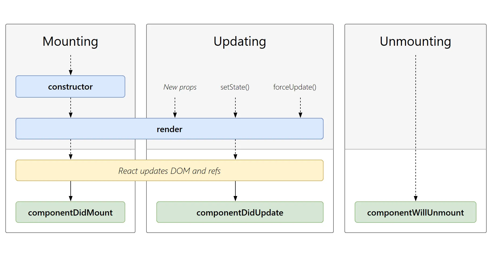

# React笔记
## 安装脚手架命令
### npx

> npx create-react-app my-app  

(npx comes with npm 5.2+ and higher, see instructions for older npm versions)


### npm

> npm init react-app my-app  

npm init `<initializer>` is available in npm 6+

### Yarn

> yarn create react-app my-app  

yarn create is available in Yarn 0.25+


## 原生开发

JS改变某个标签的文字

```javascript
    // 原生开发 -- 命令式编程
   let message =  "Hello World"
   const titleEL = document.getElementsByClassName("title")[0]
   titleEL.innerHTML = message

   const btnEL = document.getElementsByClassName("btn")[0]
   btnEL.addEventListener("click", e => {
     console.log("按钮发送了点击")
     message = 'Hello React'
     titleEL.innerHTML = message
   })

   // React -- 声明式编程
```

### React开发

#### React开发需要以来的库

- react：核心文件
- react-dom：React渲染不同平台
- babel：jsx转换为React代码

```html
   <!-- 加载 React。-->
  <!-- 注意: 部署时，将 "development.js" 替换为 "production.min.js"。-->
<script src="https://unpkg.com/react@17/umd/react.development.js" crossorigin></script>
<script src="https://unpkg.com/react-dom@17/umd/react-dom.development.js" crossorigin></script>
<script src="https://unpkg.com/babel-standalone@6/babel.min.js"></script>
```

#### 重构原生代码

重构上述更改文字的代码，使用React

```react
let message = "Hello World";

function btnClick() {
    message = 'Hello React'
    // 与vue 不同，在React变量改变不会渲染，要手动渲染
    render()
}

function render() {
    // <h2></h2>  JSX代码
    // JSX特点：多个标签最外层（根）只能有一个标签
    ReactDOM.render(
        <div>
            <h2>{message}</h2>
            <button onClick={btnClick}>改变文本</button>
        </div>, 
        document.getElementById('app')
    )
}

render()
```

再次重构React代码，使其标准化：

```react
//封装APP
class App extends React.Component {
    constructor() {
        super()
        // this.message = 'Hello World'
        this.state = {
            message: 'Hello World'
        }
    }

    render() {
        return (
            <div>
                <h2>{this.state.message}</h2>
                <button onClick={this.btnClick.bind(this)}>改变文本</button>
            </div>
        )
    }

    btnClick() {
        console.log(this);
        // this.state.message = 'Hello React'
        // 不能手动调用this.render()
        // 也不能使用this.state.message
        // 要使用setState传递对象
        this.setState({
            message: 'Hello React'
        })
    }
}

ReactDOM.render(<App/>, document.getElementById('app'))
```

### 注意点

1. 集成时，React.Component中的‘C’应该大写
1. construct中的state带this
1. render中需要渲染的变量除了带上单胡须'{}'外，还要带上this.state.变量
1. 注意ReactDOM.render中的render不要拼写错误


## JSX语法 & 语法补充

### 类的语法补充

ES5创建一个类

```javascript
// ES5中定义类
function Person(name, age) {
    this.name = name
    this.age = age
}

// 类中定义函数
Person.prototype.running = function() {
    console.log(this.name, this.age, "running");
}

var p = new Person("why", 18)
console.log(p.name, p.age)
p.running()
```

ES6创建一个类

```javascript
// ES6中通过class创建类
class Person {
    // 构造方法, 方法名固定
    constructor(name, age) {
        this.name = name
        this.age = age
    }

    // 定义方法
    running() {
        console.log(this);
        console.log(this.name, this.age, 'running');
    }
}
const p = new Person('why', 18)
console.log(p.name, p.age);
p.running()
```

ES6中继承父类：

```javascript
class Person {
    constructor(name, age) {
        this.name = name
        this.age = age
    }

    running() {
        console.log('running');
    }
}

class Student extends Person{
    constructor(name, age, sno) {
        // 子类必须初始化父类
        super(name, age)
        this.sno = sno
    }
}

const stu = new Student('Student:why', 18, 100)
console.log(stu.name, stu.age, stu.sno)
stu.running()
```

### 案例练习 -- 实践for循环

- 方法一是利用for (element of array)
- 方法二是用ES6语法中的map实现。注：外边是一个大括号

```react
class App extends React.Component{
    constructor() {
        super()
        this.state = {
            message: 'Hello World',
            movies: ['大话西游', '盗梦空间', '星际穿越', '流浪地球']
        }
    }

    render() {
        const liArray = []
        for (let movie of this.state.movies) {
            liArray.push(<li>{movie}</li>)
        }

        return(
            <div>
                <h2>电影列表1</h2>
                <ul>
                    {liArray}
                </ul>

                <h2>电影列表2</h2>
                <ul>
                    {
                        this.state.movies.map(one => {
                            return <li>{one}</li>
                        })
                    }
                </ul>
            </div>
        )
    }
}

ReactDOM.render(<App/>, document.getElementById('app'));
```

### 案例联系 -- this的运用

- 根据目前所学的方法，如果方法中要使用this，必须bind(this)，不然就是undefined

```react
class App extends React.Component {
    constructor() {
        super()
        this.state = {
            counter: 0
        }
    }

    render() {
        return (
            <div>
                <h2>当前计数：{this.state.counter}</h2>
                {/* 绑定this，方便方法使用this */}
                <button onClick={this.increment.bind(this)}>+</button>
                <button onClick={this.decrement.bind(this)}>-</button>
            </div>
        )
    }

    increment() {
        this.setState({
            counter: this.state.counter + 1
        })
    }

    decrement() {
        this.setState({
            counter: this.state.counter - 1
        })
    }
}

ReactDOM.render(<App />, document.getElementById('app'))
```

### JSX语法

> React 使用 JSX 来替代常规的 JavaScript。

> JSX 是一个看起来很像 XML 的 JavaScript 语法扩展。

> 与Vue不同，Vue使用的是模板语法（v-if、v-for）


#### 书写规范

1. 只能有一个根元素
2. 为了方便阅读，在render函数中的return后加入'()'
3. JSX可以是单标签，也可以双标签

   1. 单标签尾巴必须是'/>' ，如下所示


#### 注释书写

```react
render() {
    return (
        <div>
            {/* 我是一个注释 */}
            Hello World
        </div>
    )
}
```

#### 嵌入变量/数据

纲要：

- {}中可以显示的内容
- {}中不可以显示的内容。为什么？如果非要显示如何使用？
- JSX对象能用{}显示吗？

```react
class App extends React.Component {
    constructor() {
        super()
        this.state = {
            // 在{}中可以正常显示的内容
            name: 'rzy',
            age: 18,
            names: ['abc', 'cba', 'nba'],

            // 在{}不能显示的内容/忽略
            // 为什么？真实渲染时经常会作判断，例如：三元运算符，判断为null就不会显示，不然容易出BUG
            // 如果需要渲染出来
            test1: null,
            test2: undefined,
            test3: false,

            // 对象不能作为jsx的子类
            friend: {
                name: 'why',
                age: 40
            }
        }
    }

    render() {
        return (
            <div>
                <h2>{this.state.name}</h2>
                <h2>{this.state.age}</h2>
                <h2>{this.state.names}</h2>


                <h2>{this.state.test1}</h2>
                <h2>{this.state.test2}</h2>
                <h2>{this.state.test3}</h2>

                {/* 硬显示 */}
                <h2>{this.state.test1+''}</h2>
                <h2>{this.state.test2+''}</h2>
                <h2>{this.state.test3.toString()}</h2>

                {/* 对象作为子类 -- 错*/}
                {/* <h2>{this.state.friend}</h2>*/}
            </div>
        )
    }
}

ReactDOM.render(<App />, document.getElementById('app'))
```

#### 嵌入表达式

提纲：

- 运算符表达式
- 三元运算符
- 函数调用
- 对象解构

```react
class App extends React.Component {
    constructor() {
        super()
        this.state = {
            firstName: 'kobe',
            lastName: 'bryant',
            isLogin: true
        }
    }

    render() {
        // 对象的解构
        const { firstName, lastName, isLogin } = this.state

        return (
            <div>
                {/* 运算符表达式 */}
                <h2>{firstName + ' ' + lastName}</h2>
                <h2>{20 * 50}</h2>

                {/* 三元运算符 */}
                <h2>{isLogin ? '欢迎回来' : '请先登录'}</h2>

                {/* 函数调用 */}
                <h2>{this.getFullName()}</h2>
            </div>
        )
    }

    // 区别于setState，因为setState在类内，需要bind，getFullName不在父类中，自己定义所以不用bind
    getFullName() {
        return this.state.firstName + " " + this.state.lastName
    }
}

ReactDOM.render(<App />, document.getElementById('app'))
```

#### 绑定属性

纲要：

- 绑定普通属性
- 绑定class
- 绑定style

```react
function getSizeImage(imgUrl, size) {
    return imgUrl + `?param=${size}y${size}`
}

class App extends React.Component {
    constructor() {
        super()
        this.state = {
            title: '标题',
            imgUrl: 'http://p4.music.126.net/-8A5EGZ8hz3byulhycfk2Q==/109951165108319236.webp',
            link: 'http://www.baidu.com',
            active: true
        }
    }

    render() {
        const {title, imgUrl, link, active} = this.state

        return (
            <div>
                {/* 绑定普通属性 */}
                <h2 title={title}>我是标题</h2>
                
                <a href={link} target="_blank">百度一下</a>
                {/* 绑定class */}
                <div className="box">我是div元素</div>
                <div className={"box " + (active ? 'active' : '')}>我是div元素</div>
                <label htmlFor=""></label>
                {/* 绑定style */}
                <div style={{color: 'red', fontSize: '50px'}}>我是div，绑定style属性</div>
            </div>
        )
    }
}

ReactDOM.render(<App />, document.getElementById('app'))
```

#### 绑定事件

纲要：

- 绑定事件不像html一样onclick，使用驼峰：onClick
- 绑定this的**四种**方案

```react
class App extends React.Component {
    constructor() {
        super()
        this.state = {
            message: '按钮发送了点击！！',
            counter: 100
        },
            this.btnClick3 = this.btnClick3.bind(this) // 方案2：构造器绑定
    }

    render() {
        return (
            <div>
                <button onClick={this.btnClick}>按钮1</button>
                {/* 方案1：通过bind绑定this */}
                <button onClick={this.btnClick2.bind(this)}>按钮2</button>
                {/* 方案2：构造器绑定 */}
                <button onClick={this.btnClick3}>按钮3</button>
                {/* 方案3：定义函数时，使用箭头函数 */}
                <button onClick={this.btnClick4}>按钮4</button>
                {/* 方案4（推荐）：直接传入一个箭头函数，在箭头函数中直接传入需要执行的函数*/}
                <button onClick={() => { this.btnClick5() }}>按钮5</button>
            </div>
        )
    }

    btnClick() {
        console.log('按钮发送了点击！！');
    }

    btnClick2() {
        console.log(this.state.message);
    }

    btnClick3() {
        console.log(this.state.message);
    }

    // 箭头函数中永不绑定this，ES6中给对象增加属性的方式：class.field
    btnClick4 = () => {
        // 如果使用this这里不存在就会往上层找
        console.log(this.state.counter);
    }

    btnClick5() {
        console.log(this.state.counter);
    }
}

ReactDOM.render(<App />, document.getElementById('app'))
```

#### 传递参数

提纲：

- 传递event
- 传递函数参数，使用箭头函数

```react
<!DOCTYPE html>
<html lang="en">
  <head>
    <meta charset="UTF-8" />
    <meta http-equiv="X-UA-Compatible" content="IE=edge" />
    <meta name="viewport" content="width=device-width, initial-scale=1.0" />
    <title>Document</title>
  </head>
  <body>
    <div id="app"></div>

    <!-- React开发依赖 -->
    <script src="../js/react.development.js"></script>
    <script src="../js/react-dom.development.js"></script>
    <!-- 生产环境中不建议使用 -->
    <script src="../js/babel.min.js"></script>

    <script type="text/babel">
      class App extends React.Component {
        constructor() {
          super()

          this.state = {
            movies: ['大话西游', '海王', '流浪地球', '盗梦空间']
          }
        }

        render() {
          return (
            <div>
              <button onClick={ (e)=>{ this.btnClick(e) } }>按钮</button>
              <ul>
                {
                  this.state.movies.map((movie, index, arr)=> {
                    return <li onClick={(e) => {this.liClick(movie, index, e)}}>{movie}</li>
                  })
                }
              </ul>
            </div>
          )
        }

        btnClick(event) {
          console.log(event);
        }

        liClick(movie, index, e) {
          console.log(movie + ': ' + index);
          console.log(e);
        }

      }

      ReactDOM.render(<App />, document.getElementById('app'))
    </script>
  </body>
</html>
```

#### 条件渲染

Part one：

- _逻辑判断_
- _三元运算符_
- _逻辑与_

```react
<!DOCTYPE html>
<html lang="en">
  <head>
    <meta charset="UTF-8" />
    <meta http-equiv="X-UA-Compatible" content="IE=edge" />
    <meta name="viewport" content="width=device-width, initial-scale=1.0" />
    <title>Document</title>
  </head>
  <body>
    <div id="app"></div>

    <!-- React开发依赖 -->
    <script src="../js/react.development.js"></script>
    <script src="../js/react-dom.development.js"></script>
    <!-- 生产环境中不建议使用 -->
    <script src="../js/babel.min.js"></script>

    <script type="text/babel">
      class App extends React.Component {
        constructor() {
          super()
          this.state = {
            isLogin: true
          }
        }

        render() {
          {/* 对象的解构 */}
          const {isLogin} = this.state

          {/* 逻辑判断 */}
          let welcome = null
          if (isLogin == true) {
            welcome = <h2>欢迎回来</h2>
          } else {
            welcome = <h2>请先登录！</h2>
          }

          return (
            <div>
              {/* 三元运算符 */}
              {welcome}
              <button onClick={()=>{this.loginClick()}}>{isLogin ? '退出' : '登录'}</button>

              <hr/>

              {/* JS中最优方案：逻辑与 */}
              <h2>{isLogin && '你哈啊,zhiyu'}</h2>
            </div>
          )
        }

        loginClick() {
          this.setState({
            isLogin: !this.state.isLogin
          })
        }
      }

      ReactDOM.render(<App />, document.getElementById('app'))
    </script>
  </body>
</html>
```

part two：

- 利用`style={{CSS属性名：属性值}}`进行动态条件判断

```react
<!DOCTYPE html>
<html lang="en">
  <head>
    <meta charset="UTF-8" />
    <meta http-equiv="X-UA-Compatible" content="IE=edge" />
    <meta name="viewport" content="width=device-width, initial-scale=1.0" />
    <title>Document</title>
  </head>
  <body>
    <div id="app"></div>

    <!-- React开发依赖 -->
    <script src="../js/react.development.js"></script>
    <script src="../js/react-dom.development.js"></script>
    <!-- 生产环境中不建议使用 -->
    <script src="../js/babel.min.js"></script>

    <script type="text/babel">
      class App extends React.Component {
        constructor() {
          super()
          this.state = {
            isLogin: true
          }
        }

        render() {
          const { isLogin } = this.state

          return (
            <div>
              <button onClick={e => this.loginClick()}>{isLogin ? '退出' : '登录'}</button>
              <h2 style={{display: isLogin ? 'block' : 'none'}}>你好啊，zhiyu</h2>
            </div>
          )
        }

        loginClick() {
          this.setState({
            isLogin: !this.state.isLogin
          }) 
        }
      }

      ReactDOM.render(<App />, document.getElementById('app'))
    </script>
  </body>
</html>
```

#### 列表渲染

- 列表遍历
- 列表过滤
- 列表截取

```react
<!DOCTYPE html>
<html lang="en">
  <head>
    <meta charset="UTF-8" />
    <meta http-equiv="X-UA-Compatible" content="IE=edge" />
    <meta name="viewport" content="width=device-width, initial-scale=1.0" />
    <title>Document</title>
  </head>
  <body>
    <div id="app"></div>

    <!-- React开发依赖 -->
    <script src="../js/react.development.js"></script>
    <script src="../js/react-dom.development.js"></script>
    <!-- 生产环境中不建议使用 -->
    <script src="../js/babel.min.js"></script>

    <script type="text/babel">
      class App extends React.Component {
        constructor() {
          super()
          this.state = {
            names: ['javascript', 'java', 'C#', 'Cpp', 'Python'],
            numbers: [100, 120, 123, 501, 201, 520, 310]
          }
        }

        render() {
          const {names, numbers} = this.state

          return (
            <div>
              <ul>
                {
                  names.map((item)=> {
                    return <li>{item}</li>
                  })
                }
              </ul>
              <hr/>
              <p>数字列表：过滤</p>
              <ul>
                {
                  numbers.filter(number => number >= 50)
                  .map(item => <li>{item}</li>)
                }
              </ul>
              <hr/>
              <p>数字列表：截取</p>
              <ul>
                {
                  numbers.slice(0, 4).map(item => <li>{item}</li>)
                }
              </ul>
            </div>
          )
        }
      }

      ReactDOM.render(<App />, document.getElementById('app'))
    </script>
  </body>
</html>
```

### 案例--书籍计算

综合应用以上JSX语法：

```react
<!DOCTYPE html>
<html lang="en">
  <head>
    <meta charset="UTF-8" />
    <meta http-equiv="X-UA-Compatible" content="IE=edge" />
    <meta name="viewport" content="width=device-width, initial-scale=1.0" />
    <title>书籍内容填充</title>
    <style>
      table {
        border: 1px solid #000;
        border-collapse: collapse;
      }
      th, td {
        border: 1px solid #000;
        padding: 10px 10px;
        text-align: center;
      }

      th {
        background-color: #bdc3c7;
      }

      .count {
        margin: 5px
      }
    </style>
  </head>
  <body>
    <div id="app"></div>

    <!-- React开发依赖 -->
    <script src="../js/react.development.js"></script>
    <script src="../js/react-dom.development.js"></script>
    <!-- 生产环境中不建议使用 -->
    <script src="../js/babel.min.js"></script>

    <script src="./formatUtil.js"></script>
    <script type="text/babel">
      class App extends React.Component {
        constructor() {
          super()
          this.state = {
            books: [
              {
                id: 1,
                name: '《算法导论》',
                date: '2006-9',
                price: 85.00,
                count: 1
              },
              {
                id: 2,
                name: '《黑豹红狼》',
                date: '2021-5',
                price: 57.80,
                count: 1
              },
              {
                id: 3,
                name: '《乡下人》',
                date: '2021-5',
                price: 66.00,
                count: 1
              },
              {
                id: 4,
                name: '《切尔诺贝利的午夜》',
                date: '2021-3',
                price: 62.40,
                count: 1
              },
              {
                id: 5,
                name: '《认识世界：古代与中世纪哲学》',
                date: '2021-4',
                price: 71.90,
                count: 1
              }
            ]
          }
        }

        render() {
          return this.state.books.length ? this.renderBooks() : this.renderEmptyTips();
        }

        getTotalPrice() {
          {/*let totalPrice = 0
          for (let item of this.state.books) {
            totalPrice += item.price * item.count
          }
        return formatPrice(totalPrice)*/}
          const totalPrice = this.state.books.reduce((pre, item)=>{
            return pre + item.price * item.count;
          }, 0)
          return formatPrice(totalPrice);
        }

        removeBook(index) {
          this.setState({
            books: this.state.books.filter((item, indey) => index != indey)
          })
        }

        changeBookCount(index, count) {
          let duplicateOfBooks = [...this.state.books]
          console.log(duplicateOfBooks[index].count);
          if (duplicateOfBooks[index].count + count >= 0) {
            duplicateOfBooks[index].count += count
            this.setState({
              books: duplicateOfBooks
            })
          }
        }

        renderBooks() {
          const {books} = this.state
          return (
            <div>
              <table>
                <thead>
                  <th></th>
                  <th>书籍名称</th>
                  <th>出版日期</th>
                  <th>价格</th>
                  <th>购买数量</th>
                  <th>操作</th>
                </thead>
                <tbody>
                  {
                    books.map((item, index) => {
                      return (
                        <tr>
                          <td>{index+1}</td>
                          <td>{item.name}</td>
                          <td>{item.date}</td>
                          <td>{formatPrice(item.price)}</td>
                          <td>
                            <button onClick={e => this.changeBookCount(index, -1)}>-</button>
                            <span className='count'>{item.count}</span>
                            <button onClick={e => this.changeBookCount(index, +1)}>+</button>
                          </td>
                          <td><button onClick={() => this.removeBook(index)}>移除</button></td>
                        </tr>
                      )
                    })
                  }
                </tbody>
              </table>
              <h2>总价格：{this.getTotalPrice()}</h2>
            </div>
          )
        }

        renderEmptyTips() {
          return (
            <h2>购物车为空~！</h2>
          )
        }
      }

      ReactDOM.render(<App />, document.getElementById('app'))
    </script>
  </body>
</html>
```


## React组件化开发

### render函数能返回什么类型

- React元素

  - JSX创建
- 数组或fragments
- Protals
- 字符串或数值类型
- 布尔类型或null

### 生命周期

常用的生命周期：

- Constructor

  - 通过给this.state复制对象来初始化内部的state
  - 为事件绑定实例（this）
- componentDidMount

  - 依赖于DOM的操作
  - （推荐）发送网络请求
  - 添加订阅
- componentDidUpdate

  - 组件更新
  - 网络请求
- componentWillUnmount

  - 清除操作

整个生命周期：



具体可以参考：`https://www.runoob.com/react/react-component-life-cycle.html`

or `https://zh-hans.reactjs.org/docs/state-and-lifecycle.html`
