# Vue 2

- [Vue 2](#vue-2)
  - [（掌握）第一个Vue程序](#掌握第一个vue程序)
  - [（掌握）列表的展示](#掌握列表的展示)
  - [（掌握）计数器案例](#掌握计数器案例)
  - [（理解）MVVM开发模式](#理解mvvm开发模式)
  - [（理解）Vue的生命周期](#理解vue的生命周期)
  - [（掌握）mustache 插值操作](#掌握mustache-插值操作)
    - [Mustache](#mustache)
    - [v-once指令](#v-once指令)
    - [v-html指令](#v-html指令)
    - [v-text指令](#v-text指令)
    - [v-pre指令](#v-pre指令)
    - [v-cloak指令](#v-cloak指令)
  - [（掌握）v-bind的基本使用](#掌握v-bind的基本使用)
    - [绑定class](#绑定class)
    - [绑定style](#绑定style)
  - [(掌握)计算属性的基本使用](#掌握计算属性的基本使用)
  - [(掌握)v-on的基本使用和语法糖](#掌握v-on的基本使用和语法糖)
    - [v-on的传参问题](#v-on的传参问题)
    - [v-on的修饰符](#v-on的修饰符)
  - [(掌握)ES6部分语法总结](#掌握es6部分语法总结)
    - [let \& var的区别](#let--var的区别)
    - [const](#const)
    - [对象增强写法](#对象增强写法)
    - [filter/map/reduce 高阶函数](#filtermapreduce-高阶函数)
      - [filter](#filter)
      - [map的函数使用](#map的函数使用)
      - [reduce的函数使用](#reduce的函数使用)
    - [函数式编程的思想](#函数式编程的思想)
  - [(掌握)条件判断](#掌握条件判断)
    - [v-if v-else-if v-else的使用](#v-if-v-else-if-v-else的使用)
  - [(掌握)v-for遍历数组和对象](#掌握v-for遍历数组和对象)
    - [遍历对象](#遍历对象)
  - [(掌握) 解决虚拟DOM条件判断后输入不变的问题](#掌握-解决虚拟dom条件判断后输入不变的问题)
  - [(掌握)v-show的使用及v-if的区别](#掌握v-show的使用及v-if的区别)
  - [(掌握)过滤器](#掌握过滤器)
  - [(掌握)响应式数组方法](#掌握响应式数组方法)
    - [push ()](#push-)
    - [pop ()](#pop-)
    - [shift () :删除数组中的第一个元素](#shift--删除数组中的第一个元素)
    - [unshift (...values) : 在数组最前面添加元素](#unshift-values--在数组最前面添加元素)
    - [splice (startNum, deleteCount, ...values) : 删除/插入/替换元素](#splice-startnum-deletecount-values--删除插入替换元素)
    - [sort ()](#sort-)
    - [reverse ()](#reverse-)
  - [(掌握)v-model 表单绑定](#掌握v-model-表单绑定)
    - [v-model的原理（双向绑定）](#v-model的原理双向绑定)
    - [v-model结合radio](#v-model结合radio)
    - [v-model结合checkbox](#v-model结合checkbox)
    - [v-model结合select](#v-model结合select)
    - [值绑定](#值绑定)
    - [修饰符](#修饰符)
  - [(掌握)组件化](#掌握组件化)
    - [全局组件和局部组件](#全局组件和局部组件)
    - [父组件和子组件](#父组件和子组件)
    - [注册组件和语法糖](#注册组件和语法糖)
    - [模板的分离写法](#模板的分离写法)
    - [组件中的数据存放](#组件中的数据存放)
    - [思考](#思考)
      - [为什么data必须是个函数](#为什么data必须是个函数)
  - [(掌握) 父子组件通信](#掌握-父子组件通信)
    - [驼峰命名问题](#驼峰命名问题)
    - [父子组件 -- 子传父的基本使用](#父子组件----子传父的基本使用)
  - [(掌握) 父子组件的访问方式](#掌握-父子组件的访问方式)
    - [父访问子：$children的使用](#父访问子children的使用)
    - [父访问子：$refs的使用](#父访问子refs的使用)
    - [(不常用) 子访问父：$parent / $root](#不常用-子访问父parent--root)
  - [(掌握) slot插槽的基本使用](#掌握-slot插槽的基本使用)
    - [基本使用](#基本使用)
    - [默认值](#默认值)
    - [具名插槽](#具名插槽)
    - [编译作用域](#编译作用域)
    - [作用域插槽](#作用域插槽)

## （掌握）第一个Vue程序

ES6的写法：let 变量/const 常量

以前的JS编程方式：命令式编程

Vuejs的编程方式：声明式编程

1. 创建一个Vue对象


2. el 属性：该属性决定了Vue对象挂在到哪一个元素

3. data属性：该属性会村粗一些数据


## （掌握）列表的展示

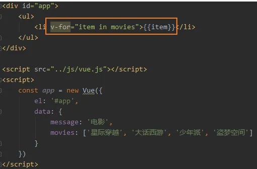


## （掌握）计数器案例

新的属性：methods

新的指定：@click（v-on:click），该指令用于监听某个元素的点击事件。执行的方法是methods定义的方法

语法糖：简写

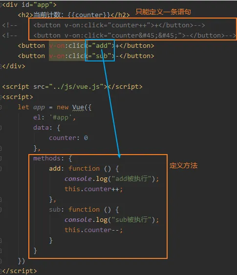


## （理解）MVVM开发模式


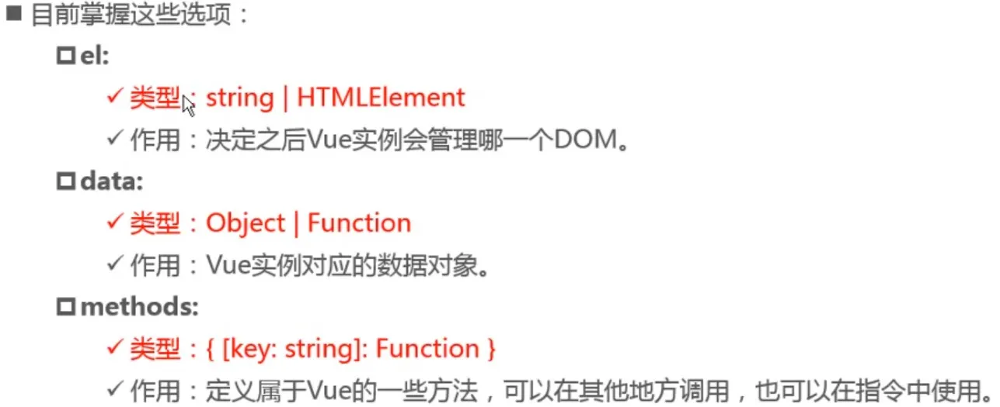


## （理解）Vue的生命周期

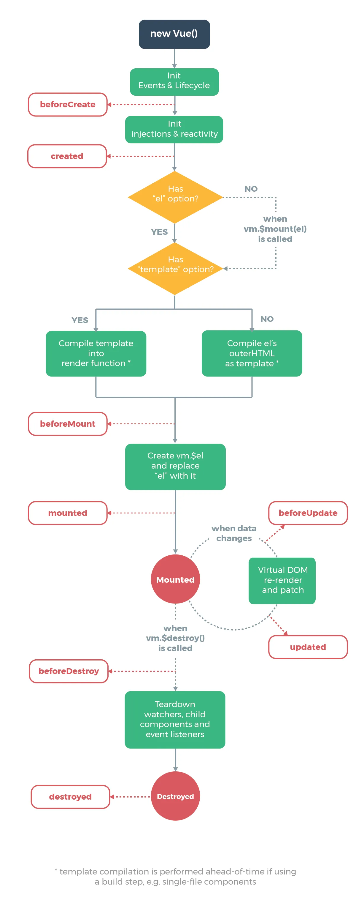

中文版


## （掌握）mustache 插值操作

### Mustache 

{{ Mustache }} 插值操作，可以让两个变量组合在一起


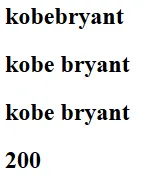

### v-once指令

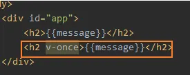

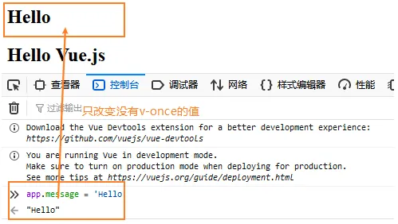

### v-html指令


### v-text指令

不灵活，一般不使用


### v-pre指令

和`<pre>`标签的效果一致


### v-cloak指令

等待解析，解析后会把v-cloak删除

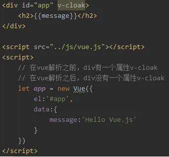


## （掌握）v-bind的基本使用

基本语法格式：**v-bind:属性**="data里的数据"

一般都是从服务器获取数据

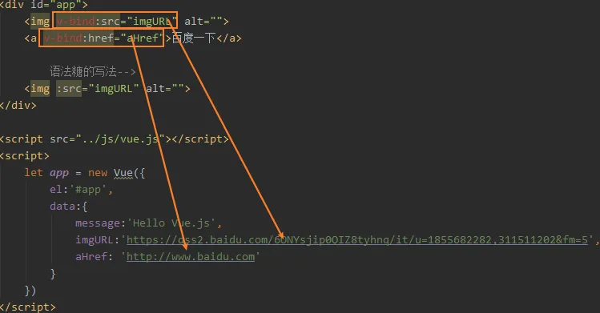

语法糖的写法： **:属性**

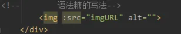**


### 绑定class

对象语法：当属性为true的时候，该类名有效。

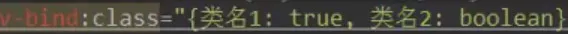


另外，在标签里在加入class会合并v-bind:class，不会被覆盖。

也可以使用methods中的方法：

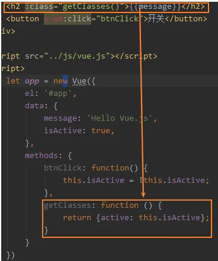

(了解)数组语法：

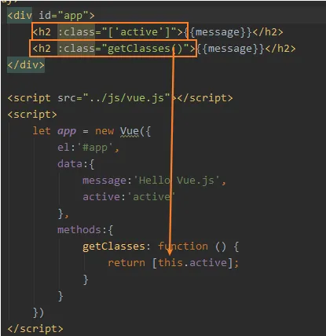


### 绑定style
两种写法：
对象：


数组（使用情况比较少）：


## (掌握)计算属性的基本使用


计算总值：

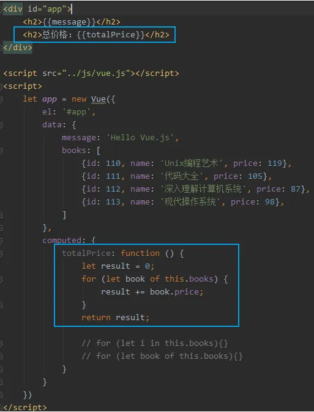

计算属性的getter和setter（完整写法）：

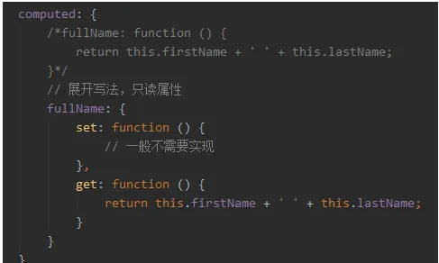

计算属性和methods的对比：

* computed比methods多具有缓存


## (掌握)v-on的基本使用和语法糖


### v-on的传参问题

重点：如果需要传入event
1. 不写()
2. 写$event

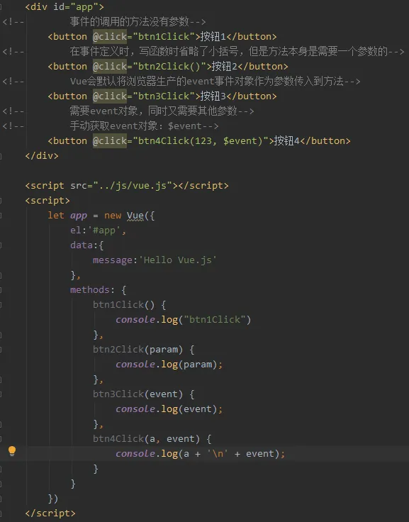

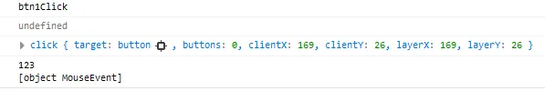


### v-on的修饰符

1. .stop
防止冒泡执行


2. .prevent
当有submit和action的时候停止action的跳转，只执行submit的方法


3.  .enter
只有按下Enter的时候才会执行

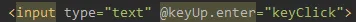

4. .once
当前方法只执行一次

 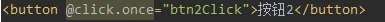


## (掌握)ES6部分语法总结

### let & var的区别

### const
常量的含义是指向的对象不能修改，但是可以改变对象内部的属性

### 对象增强写法
对象的字面量：

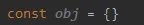


### filter/map/reduce 高阶函数
命令式编程/声明式编程
面向对象编程（对象）/函数式编程（函数）

#### filter
可选参数：

* value
* index
* array

filter中的回调函数必须返回一个boolean值

* true:函数内部会自动将这次回调的n加入到新的数组中
* false:函数内部过滤掉这次n

```javascript
const nums = [10, 20, 111, 222, 444, 40, 50];
let newNums = nums.filter(function (n) {
    return n < 100;
});
console.log(newNums);
```


#### map的函数使用
可选参数

* value
* index
* array

```javascript
let new2Nums = newNums.map(function (n) {
    return n * 2;
});
console.log(new2Nums);
```


#### reduce的函数使用

对数组中所有的内容进行汇总

- previousValues
- currentValues
- currentIndex
- Array

```javascript
new2Nums.reduce(function (preValue, n) {
    return preValue + n;
}, 0);
// new2Nums Array(4) [ 20, 40, 80, 100 ]
// 第一次 preValue = 0, n = 20 (注：preValue和上一次reduce的return有关)
// 第二次 20               40
// 第三次 60               80
// 第四次 140              100
// 240
```


### 函数式编程的思想

```javascript
let total = nums.filter(function (n) {
    return n < 100;
}).map(function (n) {
    return n * 2;
}).reduce(function (prev, n) {
    return prev + n;
}, 0);
console.log(total);
```


## (掌握)条件判断

### v-if v-else-if v-else的使用

参考：https://cn.vuejs.org/v2/guide/conditional.html


## (掌握)v-for遍历数组和对象


### 遍历对象

对象：

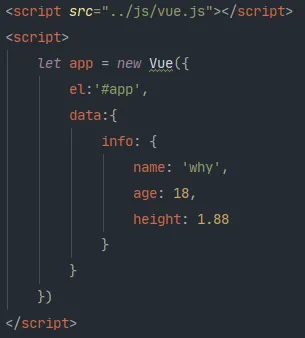

1. 在遍历对象过称中，如果只是获取一个值，那么获取到的是value

```html
<ul>
    <li v-for="item in info">{{item}}</li>
</ul>
```

2. 获取key和value 格式(value, key)

```html
<ul>
    <li v-for="(value, key) in info">{{value}}-{{key}}</li>
</ul>
```

3. 获取key和value和index  格式(value, key, index)

```html
<ul>
    <li v-for="(value, key, index) in info">{{value}}-{{key}}-{{index}}</li>
</ul>
```


## (掌握) 解决虚拟DOM条件判断后输入不变的问题

问题：
切换后不管是账号还是邮箱都是输入的文字都是不变的
直接观看视频：https://www.bilibili.com/video/BV15741177Eh?p=33


## (掌握)v-show的使用及v-if的区别


- v-if：当条件为false时，包含v-if的元素，根本不会存在dom中
- v-show：当条件为false时，v-show只是给元素添加一个行内样式：display:none

选择：

当需要显示/隐藏之间切换很频繁时候，使用v-show

当只有一次切换时，使用v-if


## (掌握)过滤器

调用：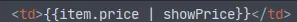

方法：

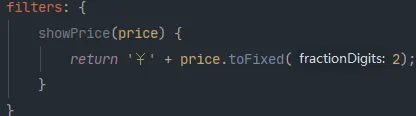


## (掌握)响应式数组方法

### push ()

```
this.letters.push('rzy');
```


### pop ()

```
this.letters.pop();
```


### shift () :删除数组中的第一个元素

```
this.letters.shift();
```


### unshift (...values) : 在数组最前面添加元素

```
this.letters.unshift('abc', 'bbb');
```


### splice (startNum, deleteCount, ...values) : 删除/插入/替换元素

- 删除元素：第二个参数传入要删除几个元素（如果没有传，就删除后面所有的元素）
- 替换元素：第二个参数表示要替换几个元素，后面是用于替换前面的元素
- 插入元素：第二个参数传入0，后面跟上插入的元素

 

```
this.letters.splice(1, 3, 'e', 't', 'c');
```


### sort ()

```
this.letters.sort();
```


### reverse ()

```
this.letters.reverse();
```


## (掌握)v-model 表单绑定

概览：

- 使用
- 原理
- 三种结合方式
- 修饰符

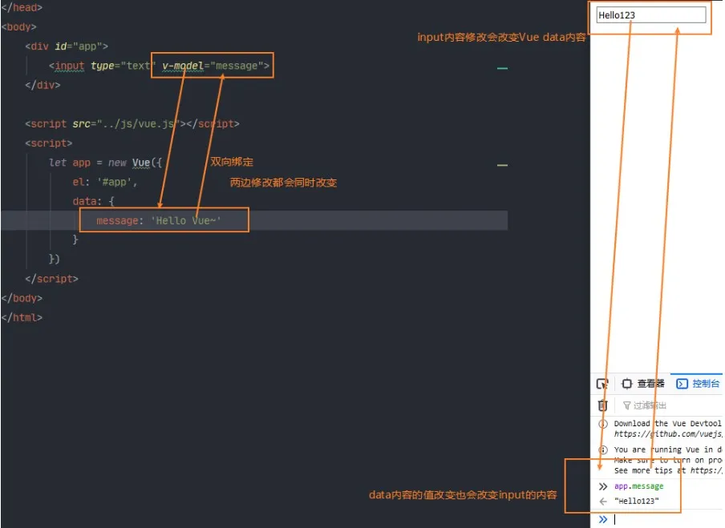

### v-model的原理（双向绑定）

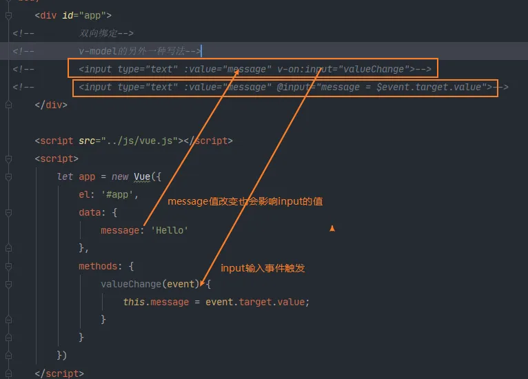


###  v-model结合radio


### v-model结合checkbox


### v-model结合select

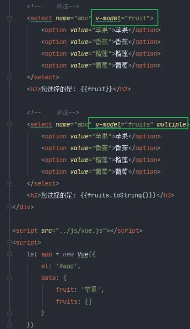


### 值绑定

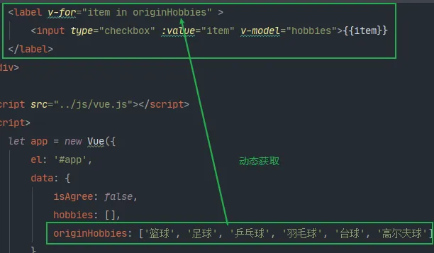


### 修饰符

前提：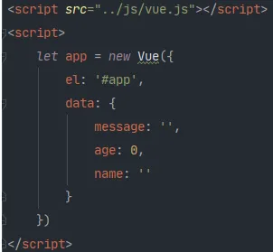

**修饰符lazy**:失去焦点/回车的时候才会加载（变量更新）

```html
<input type="text" v-model.lazy="message">
<h2>{{message}}</h2>
```

v-model默认赋值类型为string


**修饰符number**:把内容自动转为数字类型

```html
<input type="number" v-model.number="age">
<h2>{{typeof(age)}}</h2>
```


**修饰符trim**:除去两边的空格

```html
<input type="text" v-model.trim="name">
<h2>{{name}}</h2>
```


## (掌握)组件化

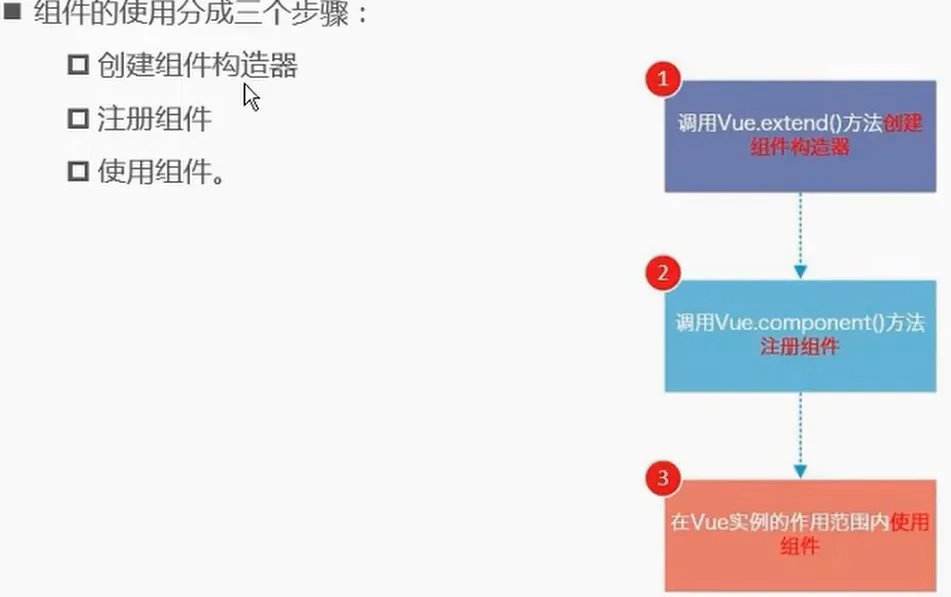


### 全局组件和局部组件
全局组件：


局部组件：


### 父组件和子组件


### 注册组件和语法糖


### 模板的分离写法

使用`<script>`标签


使用`<template>`标签

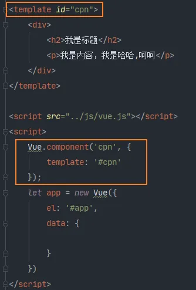


### 组件中的数据存放


### 思考
#### 为什么data必须是个函数

1. 如果是一个函数，每次都创建一个独立的空间而不对其他组件造成影响

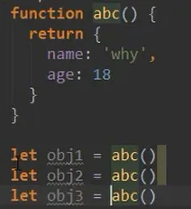

2. 如果是一个对象，每次创建都引用同一个对象，就会改变一个组件其他也跟着改变


## (掌握) 父子组件通信


type的数据类型：


### 驼峰命名问题

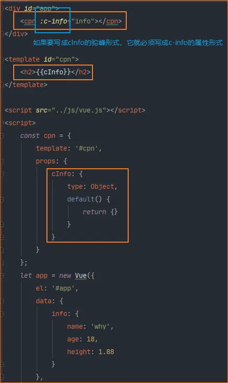

### 父子组件 -- 子传父的基本使用


小结：


## (掌握) 父子组件的访问方式

### 父访问子：$children的使用


### 父访问子：$refs的使用


### (不常用) 子访问父：$parent / $root

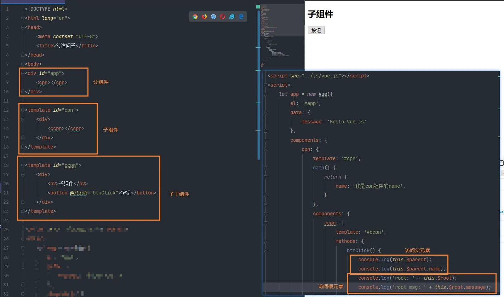


## (掌握) slot插槽的基本使用

### 基本使用


### 默认值


如果有多个值，同时放入到组件进行替换时，一起作为替换元素


### 具名插槽

~~通过给slot添加name，给添加的标签加上slot可以任意修改插槽~~

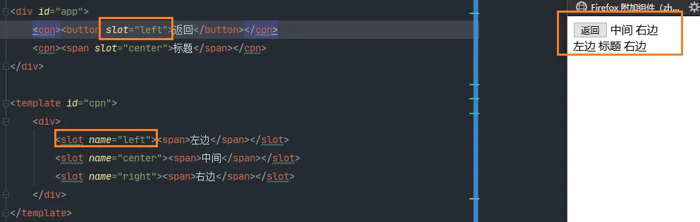

自 2.6.0 起有所更新。已废弃的使用 slot 的语法（上图），改用 v-slot 指令：


### 编译作用域
父组件模板的所有东西都会在父级作用域内编译；子组件模板的所有东西都会在子级作用域内编译


### 作用域插槽
~~父组件替换插槽的标签，但是内容由子组件来提供~~

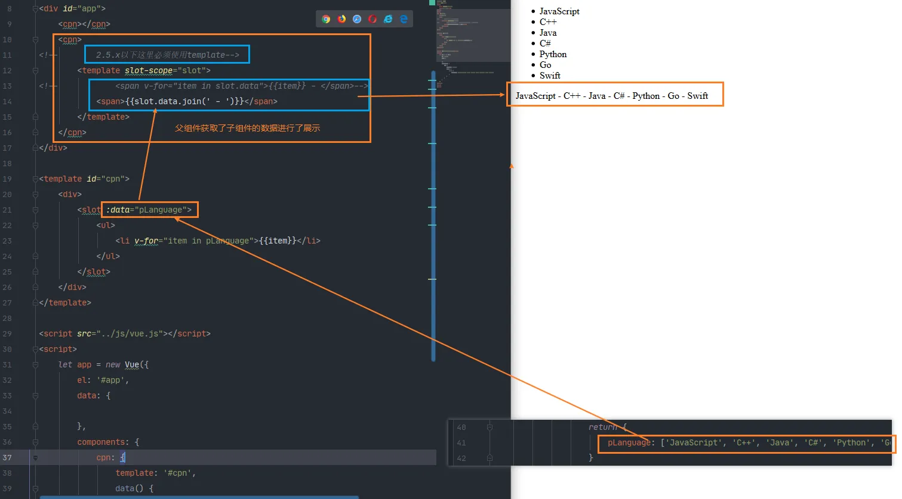

自 2.6.0 起有所更新。已废弃的使用 **slot-scope** 的语法，改用

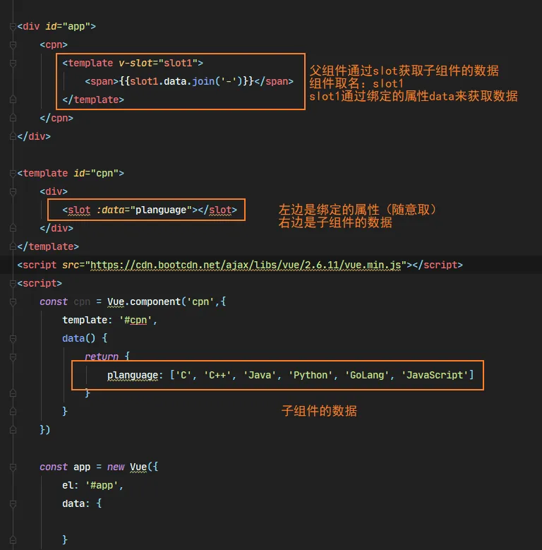
