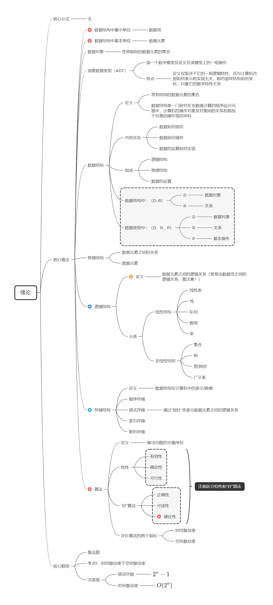
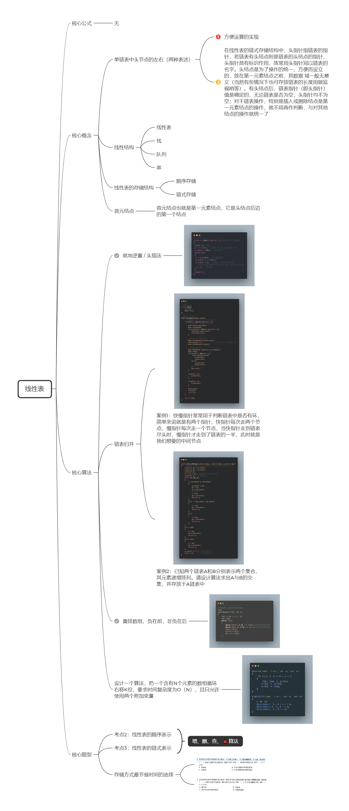
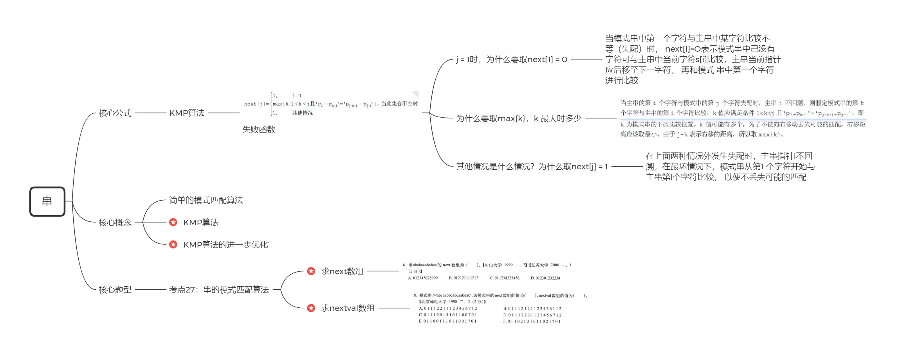
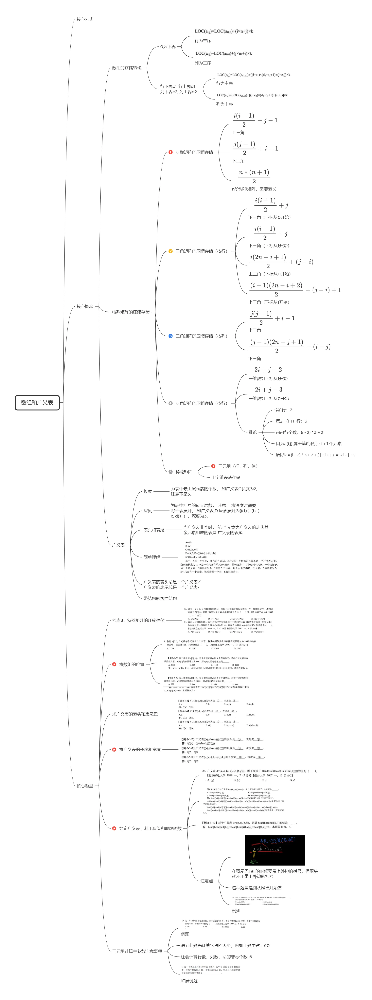
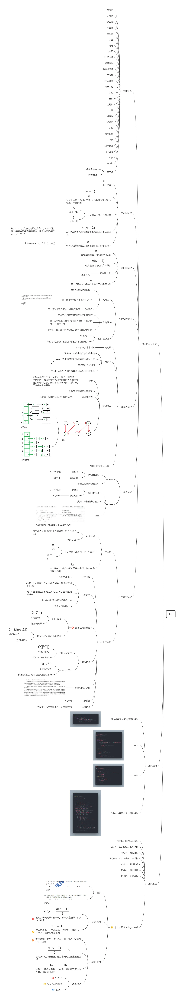
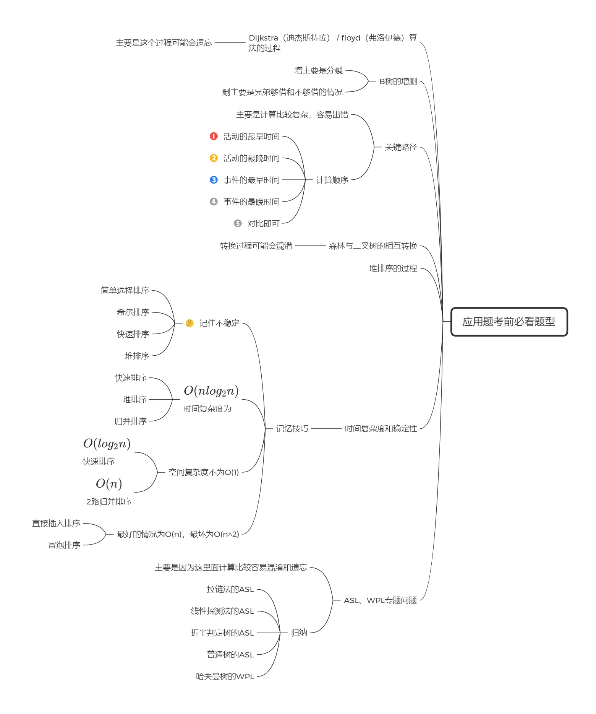

# 数据结构思维导图
This is the Data Structure mind map written down for the post-graduate examination.  这是备考研究生考试时写下的【数据结构】思维导图  

```
版本：1.4.3
作者：zhiyu1998
```

特点：适用于考研、期末考大部分题型

我参考了多本书籍，写下的做题套路，希望能帮助到你，如果有任何改进的地方可以提交issue


### 第一章   绪论




### 第二章  线性表




### 第三章  栈和队列


### 第三章 串




### 第四章  数组和广义表




### 第五章  树与二叉树


### 第六章  图




### 第七章 查找


### 第八章  排序


### 第九章  文件


### 考前必看题型



