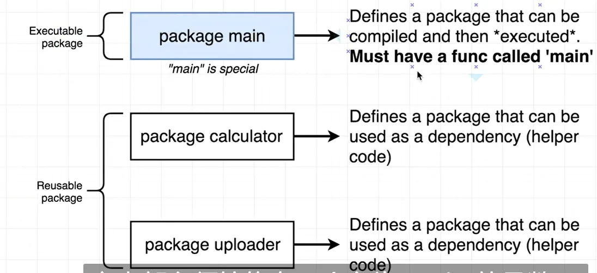
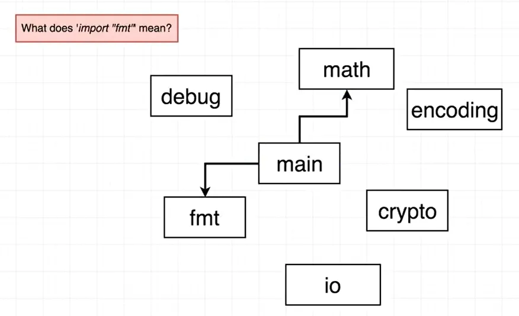
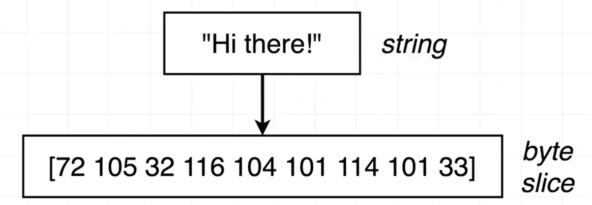
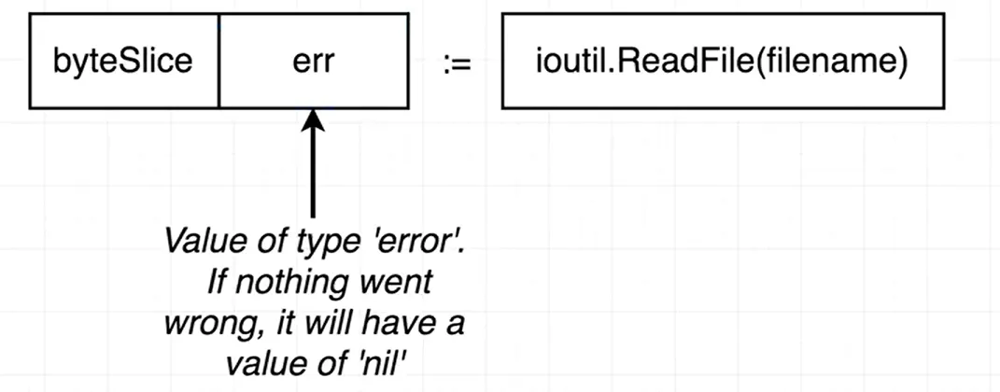
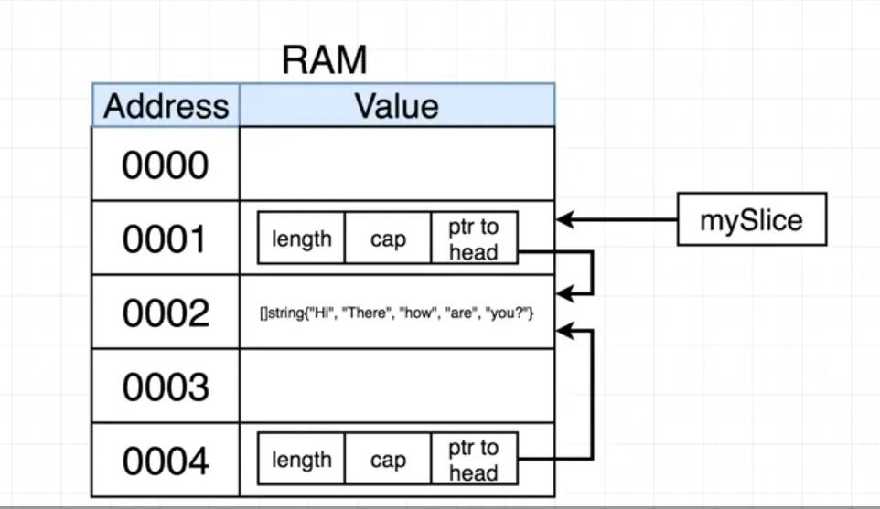
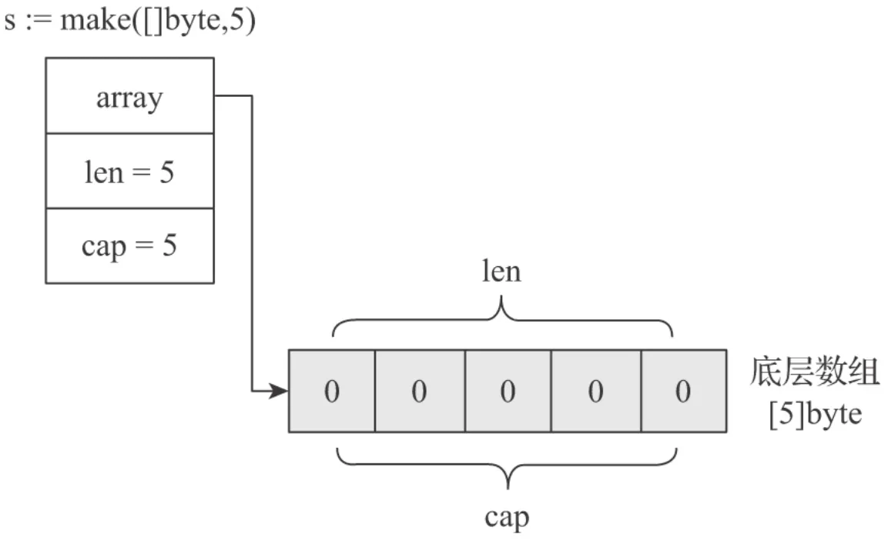
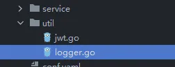
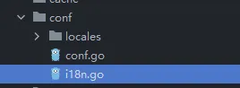

---

order: 1
title: 从问题中学习到Go的精髓
category:
  - golang
---

# Golang-Learn-In-Problem 从问题中学习到Go的精髓


## 前言

参考书目及视频：

[《The Way to Go》中文译本](https://github.com/unknwon/the-way-to-go_ZH_CN)

[Go 语言简明教程](https://geektutu.com/post/quick-golang.html)

[Go: The Complete Developer's Guide](https://www.udemy.com/course/go-the-complete-developers-guide/)


注：（[Go: The Complete Developer's Guide](https://www.udemy.com/course/go-the-complete-developers-guide/)）欢迎去购买支持此课程，非常的棒！

## Start!

下面的问题有些是自己思考问自己的，解答来自视频和思考。

还有部分问题来自极客兔兔，回答是官方FAQ（https://go.dev/doc/faq）


### Golang为什么要有一个main的包？

这个问题我在第一次学习Go的时候没有深究（因为使用的是Goland进行编写）

Golang的包分为两种：可执行包和可重复使用的包 or 依赖类型的包（里面放了很多可重用的辅助函数或可重用的东西），后者可以再分为包计算者和包上传者，如下图所示



通过实验（使用go build编译）可以看到，如果我把package换成了其他，例如：xiaomi，没有生成文件

```shell
Mode                 LastWriteTime         Length Name

----                 -------------         ------ ----

-a----         2022/5/21     21:17             76 main.go
```

如果归为main包，就可以看到

```shell
Mode                 LastWriteTime         Length Name
----                 -------------         ------ ----
-a----         2022/5/21     21:18        1891328 main.exe
-a----         2022/5/21     21:18             74 main.go
```


代码示例：

```go
package main

import "fmt"

func main() {
	fmt.Println("Hello, world!")
}
```


### Go中的import是个什么原理？

https://pkg.go.dev/std

我的理解是通过import连接其它的可重用文件（链接其他包）




### 【比较学习，举一反三】Go在声明上和Java有什么区别？

Java声明函数举例：

```java
public void main(String[] args) {}
```

Go函数声明：
```go
func main() string {}
```


Java声明变量：

```java
String a = "123";
```

Go声明变量：

```go
var a string = "123"
or
a := "123"
```


Java声明数组：

```java
int[] a = {1,2,3,4}
```

Go的切片：

```
a := []int{1, 2, 3, 4}
```

其中的不同就是Go的切片可以相当于Java使用ArrayList

```go
a = append(a, 5)
```


Java的for循环

```java
for (int i = 0; i < a.length(); i++) {}
or
for (int ac in a) {}
or (if a is a List)
a.stream().forEach(e -> xxx)
```

Go的for循环

```go
for i, num := range a {}
```

Python的for循环

```python
for i,num in range(a):
    xxxx
```


Go的自定义类型：

```go
type num []int
```

甚至可以为这个自定义类型声明一个成员函数

```go
type num []int

func (n num) print() {
	for i, nu := range n {
		fmt.Println(i, nu)
	}
}
```


上述中的 func (n num)中的`(n num)`实际上是接收器参数，每一个num类型的变量都可以调用此函数，老师的意思是实际上这是一个引用！


### Go中的返回类型和Java中有什么区别？

Go可以返回多个，这个就和Java不一样，首先在函数的屁股后面加上返回的类型和个数，然后可以选择分片返回，这是Java8做不到的

```go
func deal(d deck, handSize int) (deck, deck) {
	return d[:handSize], d[handSize:]
}
```

这里的分片又和python有异曲同工之妙，用法都一样


### Go是如何读写文件的？

写

---

首先它返回一个error，原因是这个工具包如果出错会抛出一个异常；另外toString做了把一个数组转换为一坨字符串的效果；最后的0666是权限，这个一般是任何人都可以用

```go
func (d deck) saveToFile(filename string) error {
	return ioutil.WriteFile(filename, []byte(d.toString()), 0666)
}
```

再看[]byte做了什么



最后看它函数的定义

```go
func WriteFile(filename string, data []byte, perm fs.FileMode) error

解释：WriteFile 将数据写入由文件名命名的文件。  如果文件不存在，WriteFile 使用权限 perm（在 umask 之前）创建它；  否则 WriteFile 在写入之前将其截断，而不更改权限。

// 官方例子
func main() {
	message := []byte("Hello, Gophers!")
	err := ioutil.WriteFile("hello", message, 0644)
	if err != nil {
		log.Fatal(err)
	}
}
```


读

---

先看看API函数：

```go
func ReadFile(filename string) ([]byte, error)
ReadFile 读取由 filename 命名的文件并返回内容。  成功的调用返回 err == nil，而不是 err == EOF。  因为 ReadFile 读取整个文件，所以它不会将 Read 中的 EOF 视为要报告的错误。
```

返回值也有不同



当然这时会在想[]byte如何转换成string？当然就是直接转换即可string（[]byte）

```go
bs, err := ioutil.ReadFile(filename)
if err != nil {
    // Option #1 - log the error and return a call to newDeck()
    // Option #2 - log the error and entirely quit the program
    fmt.Println("Error:", err)
    os.Exit(1)
}
s := strings.Split(string(bs), ",")
```


### Go什么时候接收器，什么时候又把这个参数放到括号内？


### Go的测试功能要怎么写呢？

在Java中直接引入包然后注解@Test即可

在Go中需要导入`testing`

参数处还有写上：`t *testing.T`

```go
func TestNewDeck(t *testing.T) {
	d := newDeck()

	if len(d) != 16 {
		t.Errorf("Expected deck length of 16, but got %v", len(d))
	}

	if d[0] != "Ace of Spades" {
		t.Errorf("Expected first card of Ace of Spades, but got %v", d[0])
	}

	if d[len(d)-1] != "Four of Clubs" {
		t.Errorf("Expected last card of Four of Clubs, but got %v", d[len(d)-1])
	}
}
```


Go如何测试文件的写入和读取？

流程是这样的：

1. 删除任何一个当前项目中含有相同名字的文件，例如："_decktesting"
2. 创建一个想要测试的类
3. 保存这个文件
4. 加载这个文件
5. 断言这个文件的长度
6. 删除现在文件中的包含这个名字的文件，例如："_decktesting"

```go
func TestSaveToDeckAndNewDeckFromFile(t *testing.T) {
	os.Remove("_decktesting")

	d := newDeck()
	d.saveToFile("_decktesting")

	loadedDeck := newDeckFromFile("_decktesting")

	if len(loadedDeck) != 16 {
		t.Errorf("Expected 16 cards in deck, got %v", len(loadedDeck))
	}

	os.Remove("_decktesting")
}
```


### Go中的结构体

老师在课程当中形容的很形象，这个struct就像python中的字典：

```go
type person struct {
	lastName  string
	firstName string
}

func main() {
	alex := person{firstName: "Alex", lastName: "Anderson"}

}
```

可以通过这个语句查看key-value：`fmt.Printf("%+v", alex)`

注：`%+v 先输出字段类型，再输出该字段的值`


### Go结构体中调用接收体会在内存中复制的问题

```go
type contactInfo struct {
	email   string
	zipCode int
}

type person struct {
	lastName  string
	firstName string
	contactInfo
}
func main() {

	jim := person{
		firstName: "Jim",
		lastName:  "Party",
		contactInfo: contactInfo{
			email:   "jim@gmail.com",
			zipCode: 94000,
		},
	}

	jim.updateName("Jimmy")

	jim.print()
}

func (pointerToPerson *person) updateName(name string) {
	(*pointerToPerson).firstName = name
}

func (p *person) print() {
	fmt.Printf("%+v", p)
}
```

如果直接调用接收体这种函数，在内存当中Go会把原先的复制，然后在新的内存中开辟再进行修改，像是下面这个图


那么，我们如果不进行复制这步操作如何呢？首先要使用`&`获取到这个结构体所在内存的位置，然后通过Go中的指针去改变当前的结构体内容

```go
...............
    jim := person{
        firstName: "Jim",
        lastName:  "Party",
        contactInfo: contactInfo{
            email:   "jim@gmail.com",
            zipCode: 94000,
        },
    }

    jimPointer := &jim
    jimPointer.updateName("Jimmy")

    jim.print()
}
func (pointerToPerson *person) updateName(name string) {
	(*pointerToPerson).firstName = name
}
```

而每当看到`*`的时候就是想看到这个指针的值

总结：每当使用接收者作为参数传给函数的时候数据就会被复制，所以默认情况下都是再副本下完成的


而在数组切片中又有所不同：

```go
import "fmt"

func main() {
	mySlice := []string{"Hi", "There", "How", "Are", "You"}

	updateSlice(mySlice)

	fmt.Println(mySlice)
}

func updateSlice(s []string) {
	s[0] = "Bye"
}
-------------------------------------------------
[Bye There How Are You]
```



每个数组都会分配这样的属性值（length, cap, ptr to head)，然后如果要进行切片操作的话就会进行一层复制，但是这个复制只是对其属性的复制，底层还是操作着同一个数组




### Map的形容介绍


### Go在创建Map的时候有什么不同？

在Go中一般有3种方法创建map

这两个是没有初始化值的

```go
var colors map[string]string

colors ;= make(map[string]string)
```

如果有值的话：

```go
colors := map[string]string{
		"red":   "#ff0000",
		"green": "#4bf745",
		"white": "#ffffff",
	}
```

而在Java中一般创建hashmap都是这样：

```java
Map<String, String> map = new HashMap<>();
or
new HashMap<Integer, String>(){
{
        put(1, "one");
        put(2, "two");
}
or
Map.ofEntries(
        entry(1, "one"),
        entry(2, "two"),
        entry(3, "three"),
)
or
Stream.of(
            new SimpleEntry<>(1, "one"),
            new SimpleEntry<>(2, "two"),
            new SimpleEntry<>(3, "three"),
).collect(Collectors.toMap(SimpleEntry::getKey, SimpleEntry::getValue));
```


而这个map的删除元素的函数也是有所不同，使用`delete`进行删除


### `=` 和 `:=` 的区别？

=是赋值变量，:=是定义变量。


### 指针的作用

 一个指针可以指向任意变量的地址，它所指向的地址在32位或64位机器上分别**固定**占4或8个字节。指针的作用有：

- 获取变量的值

```go
 import fmt
 
 func main(){
  a := 1
  p := &a//取址&
  fmt.Printf("%d\n", *p);//取值*
 }
```

- 改变变量的值

```go
 // 交换函数
 func swap(a, b *int) {
     *a, *b = *b, *a
 }
```

- 用指针替代值传入函数，比如类的接收器就是这样的。

```go
 type A struct{}
 
 func (a *A) fun(){}
```


### Go 允许多个返回值吗？

可以。通常函数除了一般返回值还会返回一个error。


### Go 有异常类型吗？

 有。Go用error类型代替try...catch语句，这样可以节省资源。同时增加代码可读性：

```go
 _,err := errorDemo()
  if err!=nil{
   fmt.Println(err)
   return
  }
```

也可以用errors.New()来定义自己的异常。errors.Error()会返回异常的字符串表示。只要实现error接口就可以定义自己的异常，

```go
 type errorString struct {
  s string
 }
 
 func (e *errorString) Error() string {
  return e.s
 }
 
 // 多一个函数当作构造函数
 func New(text string) error {
  return &errorString{text}
 }
```


### 什么是协程（Goroutine）

协程是**用户态轻量级线程**，它是**线程调度的基本单位**。通常在函数前加上go关键字就能实现并发。一个Goroutine会以一个很小的栈启动2KB或4KB，当遇到栈空间不足时，栈会**自动伸缩**， 因此可以轻易实现成千上万个goroutine同时启动。


### 如何高效地拼接字符串

 拼接字符串的方式有："+",  fmt.Sprintf,  strings.Builder, bytes.Buffer, strings.Join

1. "+"

使用`+`操作符进行拼接时，会对字符串进行遍历，计算并开辟一个新的空间来存储原来的两个字符串。

2. fmt.Sprintf

由于采用了接口参数，必须要用反射获取值，因此有性能损耗。

3. strings.Builder：

用WriteString()进行拼接，内部实现是指针+切片，同时String()返回拼接后的字符串，它是直接把[]byte转换为string，从而避免变量拷贝。

`strings.builder`的实现原理很简单，结构如下：

```go
 type Builder struct {
     addr *Builder // of receiver, to detect copies by value
     buf  []byte // 1
 }
```

`addr`字段主要是做`copycheck`，`buf`字段是一个`byte`类型的切片，这个就是用来存放字符串内容的，提供的`writeString()`方法就是像切片`buf`中追加数据：

```go
 func (b *Builder) WriteString(s string) (int, error) {
     b.copyCheck()
     b.buf = append(b.buf, s...)
     return len(s), nil
 }
```

提供的`String`方法就是将`[]byte`转换为`string`类型，这里为了避免内存拷贝的问题，使用了强制转换来避免内存拷贝：

```go
 func (b *Builder) String() string {
     return *(*string)(unsafe.Pointer(&b.buf))
 }
```

4. bytes.Buffer

`bytes.Buffer`是一个一个缓冲`byte`类型的缓冲器，这个缓冲器里存放着都是`byte`。使用方式如下：

`bytes.buffer`底层也是一个`[]byte`切片，结构体如下：

```text
type Buffer struct {
    buf      []byte // contents are the bytes buf[off : len(buf)]
    off      int    // read at &buf[off], write at &buf[len(buf)]
    lastRead readOp // last read operation, so that Unread* can work correctly.
}
```

因为`bytes.Buffer`可以持续向`Buffer`尾部写入数据，从`Buffer`头部读取数据，所以`off`字段用来记录读取位置，再利用切片的`cap`特性来知道写入位置，这个不是本次的重点，重点看一下`WriteString`方法是如何拼接字符串的：

```go
func (b *Buffer) WriteString(s string) (n int, err error) {
    b.lastRead = opInvalid
    m, ok := b.tryGrowByReslice(len(s))
    if !ok {
        m = b.grow(len(s))
    }
    return copy(b.buf[m:], s), nil
}
```

切片在创建时并不会申请内存块，只有在往里写数据时才会申请，首次申请的大小即为写入数据的大小。如果写入的数据小于64字节，则按64字节申请。采用动态扩展`slice`的机制，字符串追加采用`copy`的方式将追加的部分拷贝到尾部，`copy`是内置的拷贝函数，可以减少内存分配。

但是在将`[]byte`转换为`string`类型依旧使用了标准类型，所以会发生内存分配：

```go
func (b *Buffer) String() string {
    if b == nil {
        // Special case, useful in debugging.
        return "<nil>"
    }
    return string(b.buf[b.off:])
}
```

5. strings.join

`strings.join`也是基于`strings.builder`来实现的,并且可以自定义分隔符，代码如下：

```go
func Join(elems []string, sep string) string {
    switch len(elems) {
    case 0:
        return ""
    case 1:
        return elems[0]
    }
    n := len(sep) * (len(elems) - 1)
    for i := 0; i < len(elems); i++ {
        n += len(elems[i])
    }

    var b Builder
    b.Grow(n)
    b.WriteString(elems[0])
    for _, s := range elems[1:] {
        b.WriteString(sep)
        b.WriteString(s)
    }
    return b.String()
}
```

唯一不同在于在`join`方法内调用了`b.Grow(n)`方法，这个是进行初步的容量分配，而前面计算的n的长度就是我们要拼接的slice的长度，因为我们传入切片长度固定，所以提前进行容量分配可以减少内存分配，很高效。

```go
func main(){
	a := []string{"a", "b", "c"}
	//方式1：
	ret := a[0] + a[1] + a[2]
	//方式2：
	ret := fmt.Sprintf(a[0],a[1],a[2])
	//方式3：
	var sb strings.Builder
	sb.WriteString(a[0])
	sb.WriteString(a[1])
	sb.WriteString(a[2])
	ret := sb.String()
	//方式4：
	buf := new(bytes.Buffer)
	buf.Write(a[0])
	buf.Write(a[1])
	buf.Write(a[2])
	ret := buf.String()
	//方式5：
	ret := strings.Join(a,"")
}
```

总结：

strings.Join ≈ strings.Builder > bytes.Buffer >  "+" > fmt.Sprintf

> 参考资料：[字符串拼接性能及原理 | Go 语言高性能编程 | 极客兔兔](https://geektutu.com/post/hpg-string-concat.html)


### 什么是 rune 类型

 rune是int32的别名，用来区分字符值和整数值。比如utf-8汉字占3个字节，按照一般方法遍历汉字字符串得到的是乱码，这个时候要将字符串转换为rune:

```go
	sample := "我爱GO"
	runeSamp := []rune(sample)
	runeSamp[0] = '你'
	fmt.Println(string(runeSamp))
```


###  如何判断 map 中是否包含某个 key ？

```go
var sample map[int]int
if _, ok := sample[10];ok{

}else{

}
```


### Go 支持默认参数或可选参数吗？

不支持。但是可以利用结构体参数，或者...传入参数切片。


### defer 的执行顺序

defer执行顺序和调用顺序相反，类似于栈先进后出。


### 如何交换 2 个变量的值？

对于变量而言`a,b = b,a`； 对于指针而言`*a,*b = *b, *a`


### Go 语言 tag 的用处？

 tag可以为结构体成员提供属性。常见的：

1. json序列化或反序列化时字段的名称
2. db: sqlx模块中对应的数据库字段名
3. form: gin框架中对应的前端的数据字段名
4. binding: 搭配 form 使用, 默认如果没查找到结构体中的某个字段则不报错值为空, binding为 required 代表没找到返回错误给前端


### 如何判断 2 个字符串切片（slice) 是相等的？

 利用反射：

```go
type Author struct {
	Name         int      `json:Name`
	Publications []string `json:Publication,omitempty`
}

func main() {
	t := reflect.TypeOf(Author{})
	for i := 0; i < t.NumField(); i++ {
		name := t.Field(i).Name
		s, _ := t.FieldByName(name)
		fmt.Println(s.Tag)
	}
}
```


### 字符串打印时，`%v` 和 `%+v` 的区别

`%v`输出结构体各成员的值；

`%+v`输出结构体各成员的名称和值；

`%#v`输出结构体名称和结构体各成员的名称和值


### Go 语言中如何表示枚举值(enums)？

 在常量中用iota可以表示枚举。iota从0开始。

```go
const (
	B = 1 << (10 * iota)
	KiB 
	MiB
	GiB
	TiB
	PiB
	EiB
)
```


### 空 struct{} 的用途

1. 用map模拟一个set，那么就要把值置为struct{}，struct{}本身不占任何空间，可以避免任何多余的内存分配。
2. 有时候给通道发送一个空结构体,channel<-struct{}{}，也是节省了空间。
3. 仅有方法的结构体


### go里面的int和int32是同一个概念吗？

不是一个概念！千万不能混淆。go语言中的int的大小是和操作系统位数相关的，如果是32位操作系统，int类型的大小就是4字节。如果是64位操作系统，int类型的大小就是8个字节。除此之外uint也与操作系统有关。

int8占1个字节，int16占2个字节，int32占4个字节，int64占8个字节。


## Java过渡Go的第一个项目：TodoList

这个章节主要是学习Gin的项目架构搭建，如果以后要搭建web项目直接起一个脚手架项目很快就能搭建起来，如果项目架构都不熟悉，那么怎么使用脚手架呢？

### 前言

感谢以下仓库对我学习的帮助：

* [Automatically generate RESTful API documentation with Swagger 2.0 for Go.    ](https://github.com/swaggo/swag)
* [Gin+Gorm+Redis+Swagger 基于 RESTful API 规范搭建备忘录](https://github.com/CocaineCong/TodoList)
* [Gin+Gorm开发Golang API快速开发脚手架 ](https://github.com/gourouting/singo)

> 注：备忘录的架构是在Singo的基础上搭建的。


### 搭建外设

首先搭建脚手架，按照Singo的结构先学习Golang在Gin上的基本架构：


把文件搭建起来后可以开始先给`main.go`，可以看到TodoList仓库中主要分三步走：

```go
func main() { // http://localhost:3000/swagger/index.html
	//从配置文件读入配置
	conf.Init()
	//转载路由 swag init -g common.go
	r := routes.NewRouter()
	_ = r.Run(conf.HttpPort)
}
```

那么首先把init先写上，说明我们第一步要做的就是初始化配置（本次教程放弃了读取ini，改用yaml文件）：

1. 创建YAML配置文件（放弃redis，根本用不到）

```yaml
service:
  mode: debug
  port: :8080

#redis:
#  addr: 127.0.0.1:6379

mysql:
  host: 用户名:密码@tcp(地址:端口号)/数据库?charset=utf8&parseTime=True&loc=Local
```

2. 然后再conf文件下创建一个`init.go`，读取yaml，然后分别丢给数据库（mysql），Gin（service）

```go
import (
	"TodoList/model"
	"TodoList/util"
	"gopkg.in/yaml.v3"
	"io/ioutil"
)

type Config struct {
	Service *Service `yaml:"service"`
	DB      *DB      `yaml:"mysql"`
}
type Service struct {
	AppMode  string `yaml:"mode"`
	HttpPort string `yaml:"port"`
	//RedisAddr string `yaml:"redis.addr"`
}
type DB struct {
	DbHost string `yaml:"host"`
}

var Port string

// Init 初始化配置项
func Init() {

	var ginProperties Config

	file, err := ioutil.ReadFile("./conf.yaml")

	if err != nil {
		util.Log().Error("配置文件读取错误，请检查文件路径:", err)
	}
	if err := LoadLocales("conf/locales/zh-cn.yaml"); err != nil {
		util.Log().Error("i18n配置文件读取错误，请检查文件路径:", err) //日志内容
	}
	if err = yaml.Unmarshal(file, &ginProperties); err != nil {
		util.Log().Error("YAML文件解析失败") //日志内容
	}

	model.Database(ginProperties.DB.DbHost)
	Port = ginProperties.Service.HttpPort
}
```

3. 然后把Singo的日志文件给复制过来，放到util文件夹下（忽略jwt，这是后面才会用到）：



4. 还可以复制的有conf下的i18n文件，locales和i18n.go都可以复制到conf文件下：



### 建立数据库

1. 在搭建外设的章节可以顺着思路下来，已经把配置文件的sql连接地址转交给了gorm（model/init.go），这里singo也把连接数据库封装好了，直接拿过来用：

```go
// DB 数据库链接单例
var DB *gorm.DB

// Database 在中间件中初始化mysql链接
func Database(connString string) {

	// 初始化GORM日志配置
	newLogger := logger.New(
		log.New(os.Stdout, "\r\n", log.LstdFlags), // io writer
		logger.Config{
			SlowThreshold:             time.Second, // Slow SQL threshold
			LogLevel:                  logger.Info, // Log level(这里记得根据需求改一下)
			IgnoreRecordNotFoundError: true,        // Ignore ErrRecordNotFound error for logger
			Colorful:                  false,       // Disable color
		},
	)

	db, err := gorm.Open(mysql.Open(connString), &gorm.Config{
		Logger: newLogger,
	})
	// Error
	if connString == "" || err != nil {
		util.Log().Error("mysql lost: %v", err)
		panic(err)
	}
	sqlDB, err := db.DB()
	if err != nil {
		util.Log().Error("mysql lost: %v", err)
		panic(err)
	}

	//设置连接池
	//空闲
	sqlDB.SetMaxIdleConns(10)
	//打开
	sqlDB.SetMaxOpenConns(20)
	DB = db

	migration()
}
```

2. 但是此时的运行不起来的，要完成migration，这属于GORM的范畴了，具体学习可以到：https://gorm.io/zh_CN/docs/migration.html

> 这边目前只起搭建项目目的，所以只建了一个user，后续的顺序是：创建一个user.go -》 migration.go 运行

user.go

```go
type User struct {
	gorm.Model
	UserName       string `gorm:"unique"`
	PasswordDigest string
}

const (
	// PassWordCost 密码加密难度
	PassWordCost = 12
)

func (user *User) SetPassword(password string) error {
	bytes, err := bcrypt.GenerateFromPassword([]byte(password), PassWordCost)
	if err != nil {
		return err
	}
	user.PasswordDigest = string(bytes)
	return nil
}

func (user *User) CheckPassword(password string) bool {
	err := bcrypt.CompareHashAndPassword([]byte(user.PasswordDigest), []byte(password))
	return err == nil
}
```

migration.go

```go
//执行数据迁移
func migration() {
	// 自动迁移模式
	_ = DB.AutoMigrate(&User{})
}
```

此时运行main函数就可以看到底层数据库已经创建了user的数据表


此时的`user.go`也就是Java中的`DO`对象


### 搭建VO对象

这时我们只要创建两个文件即可：

* common.go 专门返回给前端的response二次封装
* user.go 这里是返回给前端哪些需要的用户数据

common.go，直接复制脚手架的文件，然后再加点自己的状态码，返回类型就有以下内容：

下面的内容主要都是包含状态码和返回内容（Java中对json的二次封装，比如返回要返回状态码200还是500，返回什么内容）

```go
// Response 基础序列化器
type Response struct {
	Code  int         `json:"code"`
	Data  interface{} `json:"data,omitempty"`
	Msg   string      `json:"msg"`
	Error string      `json:"error,omitempty"`
}

// TrackedErrorResponse 有追踪信息的错误响应
type TrackedErrorResponse struct {
	Response
	TrackID string `json:"track_id"`
}

//TokenData 带有token的Data结构
type TokenData struct {
	User  interface{} `json:"user"`
	Token string      `json:"token"`
}

type ResponseUser struct {
	Status int    `json:"status" example:"200"`
	Data   User   `json:"data"`
	Msg    string `json:"msg" example:"ok"`
	Error  string `json:"error" example:""`
}

// 三位数错误编码为复用http原本含义
// 五位数错误编码为应用自定义错误
// 五开头的五位数错误编码为服务器端错误，比如数据库操作失败
// 四开头的五位数错误编码为客户端错误，有时候是客户端代码写错了，有时候是用户操作错误
const (
	// CodeCheckLogin 未登录
	CodeCheckLogin = 401
	// CodeNoRightErr 未授权访问
	CodeNoRightErr = 403
	// CodeDBError 数据库操作失败
	CodeDBError = 50001
	// CodeEncryptError 加密失败
	CodeEncryptError = 50002
	//CodeParamErr 各种奇奇怪怪的参数错误
	CodeParamErr               = 40001
	ErrorExistUser             = 10002 //成员错误
	ErrorNotExistUser          = 10003
	ErrorFailEncryption        = 10006
	ErrorNotCompare            = 10007
	ErrorAuthCheckTokenFail    = 30001 //token 错误
	ErrorAuthCheckTokenTimeout = 30002 //token 过期
	ErrorAuthToken             = 30003
	ErrorAuth                  = 30004
	ErrorDatabase              = 40001
)

// CheckLogin 检查登录
func CheckLogin() Response {
	return Response{
		Code: CodeCheckLogin,
		Msg:  "未登录",
	}
}

// Err 通用错误处理
func Err(errCode int, msg string, err error) Response {
	res := Response{
		Code: errCode,
		Msg:  msg,
	}
	// 生产环境隐藏底层报错
	if err != nil && gin.Mode() != gin.ReleaseMode {
		res.Error = err.Error()
	}
	return res
}

// DBErr 数据库操作失败
func DBErr(msg string, err error) Response {
	if msg == "" {
		msg = "数据库操作失败"
	}
	return Err(CodeDBError, msg, err)
}

// ParamErr 各种参数错误
func ParamErr(msg string, err error) Response {
	if msg == "" {
		msg = "参数错误"
	}
	return Err(CodeParamErr, msg, err)
}
```

user.go

主要是封装返回给前端的字段，一开始看也很懵，为什么这个字段感觉和model里的User一样还要写一遍？而且下面的BuildUser是个什么鬼？

* 这里解答：BuildUser是在等下的service层会用到，是用来给jwt的

```go
type User struct {
	ID       uint   `json:"id" form:"id" example:"1"`                    // 用户ID
	UserName string `json:"user_name" form:"user_name" example:"FanOne"` // 用户名
	CreateAt int64  `json:"create_at" form:"create_at"`                  // 创建
}

func BuildUser(user model.User) User {
	return User{
		ID:       user.ID,
		UserName: user.UserName,
		CreateAt: user.CreatedAt.Unix(),
	}
}
```


### 搭建Service层

有了上述的基础，就可以搭建service层了，在TodoList项目中的日志框架用了第三方的框架，本次教程则采用原生在util文件下封装的框架作为日志框架。

下面的这段代码实在理解不了可以直接照着抄一下：

```go
type UserService struct {
	UserName string `form:"user_name" json:"user_name" binding:"required,min=3,max=15" example:"FanOne"`
	Password string `form:"password" json:"password" binding:"required,min=5,max=16" example:"FanOne666"`
}

func (service *UserService) Register() *serializer.Response {
	var user model.User
	var count int64
	model.DB.Model(&model.User{}).Where("user_name=?", service.UserName).First(&user).Count(&count)
	if count == 1 {
		code := serializer.ErrorExistUser
		return &serializer.Response{
			Code: code,
			Msg:  "成员错误",
		}
	}
	user.UserName = service.UserName
	//加密密码
	if err := user.SetPassword(service.Password); err != nil {
		util.Log().Error(err.Error())
		code := serializer.ErrorFailEncryption
		return &serializer.Response{
			Code: code,
			Msg:  "加密失败",
		}
	}
	//创建用户
	if err := model.DB.Create(&user).Error; err != nil {
		util.Log().Error(err.Error())
		code := serializer.ErrorDatabase
		return &serializer.Response{
			Code: code,
			Msg:  "创建用户失败",
		}
	}
	return &serializer.Response{
		Code: http.StatusOK,
		Msg:  "成功创建",
	}
}

func (service *UserService) Login() serializer.Response {
	var user model.User
	code := http.StatusOK

	if err := model.DB.Where("user_name=?", service.UserName).First(&user).Error; err != nil {
		// 查询不到，返回错误
		if errors.Is(err, gorm.ErrRecordNotFound) {
			util.Log().Error(err.Error())
			code = serializer.ErrorExistUser
			return serializer.Response{
				Code: code,
				Msg:  "用户不存在！",
			}
		}
		util.Log().Info(err.Error())
		return serializer.DBErr("", err)
	}

	if user.CheckPassword(service.Password) == false {
		code := serializer.ErrorNotCompare
		return serializer.Response{
			Code: code,
			Msg:  "密码错误",
		}
	}

	token, err := util.GenerateToken(user.ID, service.UserName, 0)
	if err != nil {
		util.Log().Error(err.Error())
		code = serializer.ErrorAuthToken
		return serializer.Response{
			Code: code,
			Msg:  "Token授权失败",
		}
	}

	return serializer.Response{
		Code: code,
		Data: serializer.TokenData{User: serializer.BuildUser(user), Token: token},
		Msg:  "登录成功！",
	}
}

```


唯一要注意的就是，在登录用户的模块中，需要使用到JWT框架，如下所示：

```go
token, err := util.GenerateToken(user.ID, service.UserName, 0)
	if err != nil {
		util.Log().Error(err.Error())
		code = serializer.ErrorAuthToken
		return serializer.Response{
			Code: code,
			Msg:  "Token授权失败",
		}
	}
```

go-jwt好像换维护者了，地址：https://github.com/golang-jwt/jwt，用法也稍有不同。

> ```
> go get -u github.com/golang-jwt/jwt/v4
> ```

下面这段代码是对TodoList util 中的`jwt.go`进行一些修改：

```go
var jwtSecret = []byte(os.Getenv("JWT_SECRET"))

type Claims struct {
	Id        uint   `json:"id"`
	Username  string `json:"username"`
	Authority int    `json:"authority"`
	jwt.RegisteredClaims
}

//GenerateToken 签发用户Token
func GenerateToken(id uint, username string, authority int) (string, error) {
	nowTime := time.Now()
	expireTime := nowTime.Add(24 * time.Hour)
	claims := Claims{
		Id:        id,
		Username:  username,
		Authority: authority,
		RegisteredClaims: jwt.RegisteredClaims{
			ExpiresAt: jwt.NewNumericDate(expireTime),
			Issuer:    "to-do-list",
		},
	}
	tokenClaims := jwt.NewWithClaims(jwt.SigningMethodHS256, claims)
	token, err := tokenClaims.SignedString(jwtSecret)
	return token, err
}

//ParseToken 验证用户token
func ParseToken(token string) (*Claims, error) {
	tokenClaims, err := jwt.ParseWithClaims(token, &Claims{}, func(token *jwt.Token) (interface{}, error) {
		return jwtSecret, nil
	})
	if tokenClaims != nil {
		if claims, ok := tokenClaims.Claims.(*Claims); ok && tokenClaims.Valid {
			return claims, nil
		}
	}
	return nil, err
}
```

封装了之后，在登录用户模块就可以使用JWT了。


登录模块的最后可以看到：

```go
return serializer.Response{
		Code: code,
		Data: serializer.TokenData{User: serializer.BuildUser(user), Token: token},
		Msg:  "登录成功！",
	}
```

里面就用到：

> serializer.BuildUser(user)

这就是刚刚在封装的BuildUser


### Controller层

最后，你可以直接复制Todo List项目中的api下的user.go，因为你已经从实体类层一直搭建到这里，肯定知道里面的原理，当然，你也可以直接复制下面我写的代码：

```go
var userRegisterService service.UserService

func UserRegister(c *gin.Context) {
	if err := c.ShouldBind(&userRegisterService); err == nil {
		res := userRegisterService.Register()
		c.JSON(200, res)
	} else {
		c.JSON(400, ErrorResponse(err))
		util.Log().Error(err.Error())
	}
}

func UserLogin(c *gin.Context) {
	var userLoginService service.UserService
	if err := c.ShouldBind(&userLoginService); err == nil {
		res := userLoginService.Login()
		c.JSON(200, res)
	} else {
		c.JSON(400, ErrorResponse(err))
		util.Log().Error(err.Error())
	}
}
```

> 注：如果你是复制TodoList项目中的代码话，请忽略注释里面的内容，因为那个是swagger必须要写的


同时，api/common还有一个文件是`common.go`，这个在本次项目中是封装返回错误信息的controller，直接复制也可以

```go
//返回错误信息 ErrorResponse
func ErrorResponse(err error) serializer.Response {
	if ve, ok := err.(validator.ValidationErrors); ok {
		for _, e := range ve {
			field := conf.T(fmt.Sprintf("Field.%s", e.Field))
			tag := conf.T(fmt.Sprintf("Tag.Valid.%s", e.Tag))
			return serializer.Response{
				Code:  40001,
				Msg:   fmt.Sprintf("%s%s", field, tag),
				Error: fmt.Sprint(err),
			}
		}
	}
	if _, ok := err.(*json.UnmarshalTypeError); ok {
		return serializer.Response{
			Code:  40001,
			Msg:   "JSON类型不匹配",
			Error: fmt.Sprint(err),
		}
	}
	return serializer.Response{
		Code:  40001,
		Msg:   "参数错误",
		Error: fmt.Sprint(err),
	}
}

```


### 搭建路由

当你搭建完上述的项目，肯定还启动不起来，gin不知道你访问的地址是个什么东西，所以用gin.engine搭建路由：

这里先把swagger的写上去，等下要用到

```go
func NewRouter() *gin.Engine {
	r := gin.Default()
	r.GET("/swagger/*any", ginSwagger.WrapHandler(swaggerFiles.Handler)) // 开启swag

	// 路由
	v1 := r.Group("/api/v1")
	{
		v1.GET("ping", func(c *gin.Context) {
			c.JSON(200, "success")
		})
		// 用户操作
		v1.POST("user/register", api.UserRegister)
		v1.POST("user/login", api.UserLogin)
	}
	return r
}
```


### 临时测试

当搭建好路由以后，就可以在main函数上告诉gin你的url，你就可以访问到地址了

```go
func main() {
	conf.Init()
	r := routes.NewRouter()
	_ = r.Run(conf.Port)
}
```


### 搭建swagger进行测试

完全可以按照：https://github.com/swaggo/swag/blob/master/README_zh-CN.md，进行操作。

当然有几个坑要注意：

1. 在main函数中你可能会写到：

```go
// programatically set swagger info
docs.SwaggerInfo.Title = "Todo List"
docs.SwaggerInfo.Description = "This is a simple ToDoList App."
docs.SwaggerInfo.Version = "1.0"
docs.SwaggerInfo.Host = "localhost:8080"
docs.SwaggerInfo.BasePath = "/api/v1"
docs.SwaggerInfo.Schemes = []string{"http", "https"}
```

请组合以把导入的docs改一下，比如我初始化go项目的时候是：go mod init TodoList，那么我这里导入的docs

> ```go
> import (
>    "TodoList/conf"
>    "TodoList/docs"
>    "TodoList/routes"
> )
> ```

2. 在controller层写go doc的时候是函数的名字！

```go
// UserRegister godoc
// @Summary      用户注册
// @Description  用户注册
// @Tags         USER
// @Accept       json
// @Produce      json
// @Param        data  body      service.UserService      true  "用户名, 密码"
// @Success      200  {object}  serializer.ResponseUser  "{"status":200,"data":{},"msg":"ok"}"
// @Failure      500  {object}  serializer.ResponseUser  "{"status":500,"data":{},"Msg":{},"Error":"error"}"
// @Router       /user/register [post]
func UserRegister(c *gin.Context) {
    ....
}
```

然后后续测试就可以看到成功的标志，也可以继续学习完TodoList这个项目了：


### 后记

一开始做这个项目的时候十分艰难，Java架构思想根深蒂固（一开始看到那个logger整个人都不好，又不会用依赖注入，又想用zap替代，最后搞来搞去还是回归到了原生logger），看到Gin这个架构满身的细胞都在抗拒，后面又做了几天又感觉自己又行了，整个过程像在做过山车一样！


## 外传：项目实践：单例爬虫、协程并发爬虫

### 使用说明

文件名称：Spiders

初始化mod
> go mod init xxx

安装goquery库（仅微博使用）

### 新浪微博
单例爬虫（需要cookie）

### 美之图
高并发协程爬虫


## 问题汇总

[go语言/golang protobuf windows解决方案](https://blog.csdn.net/qq_26041727/article/details/121728316?spm=1001.2014.3001.5501)