---

order: 1
author: zhiyu1998
title: 软件推荐
category:
  - 推荐
---

## 第一期：网易云音乐的净土（HyPlayer、LyricEase）

### HyPlayer

[GitHub地址](https://github.com/HyPlayer/HyPlayer)

> HyPlayer是一款开源的第三方网易云播放器，几乎还原了官方功能，界面简洁清爽。第三方的播放器基于官方API开发，功能与官方相似，但还加入了自定义功能和个性化界面。支持登录、同步歌单、每日推荐、私人FM等功能，并支持播放、下载歌曲、查看、发表评论等。界面设计简洁美观，可切换暗黑和明亮主题。

**歌单页面**

**歌词页面**

**主页**

**用户页面**

**搜索页面**

**小窗播放**

**Toast 歌词**

### LricsEase
[安装地址](https://install.appcenter.ms/users/brandonw3612/apps/lyricease/distribution_groups/public)

> "LyricEase是微软商店中的网易云音乐第三方客户端，旨在提供纯净的音乐体验，删除冗杂元素，追求音乐本质，并为网易云音乐用户带来最纯粹的音乐体验。该客户端献给每位创作者和音乐爱好者，删去无关内容，回归音乐本身，让用户享受词曲的深刻意蕴，并发现自己。"

**浅色主题**

**深色主题**

**歌曲详情**

**列表**

**推荐列表**

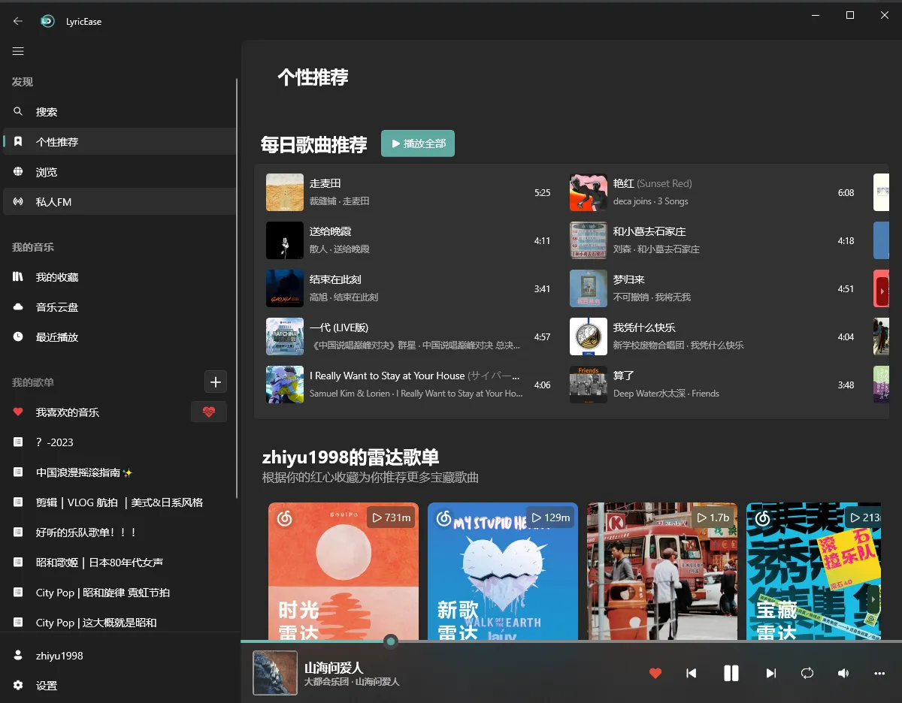

**推荐2**

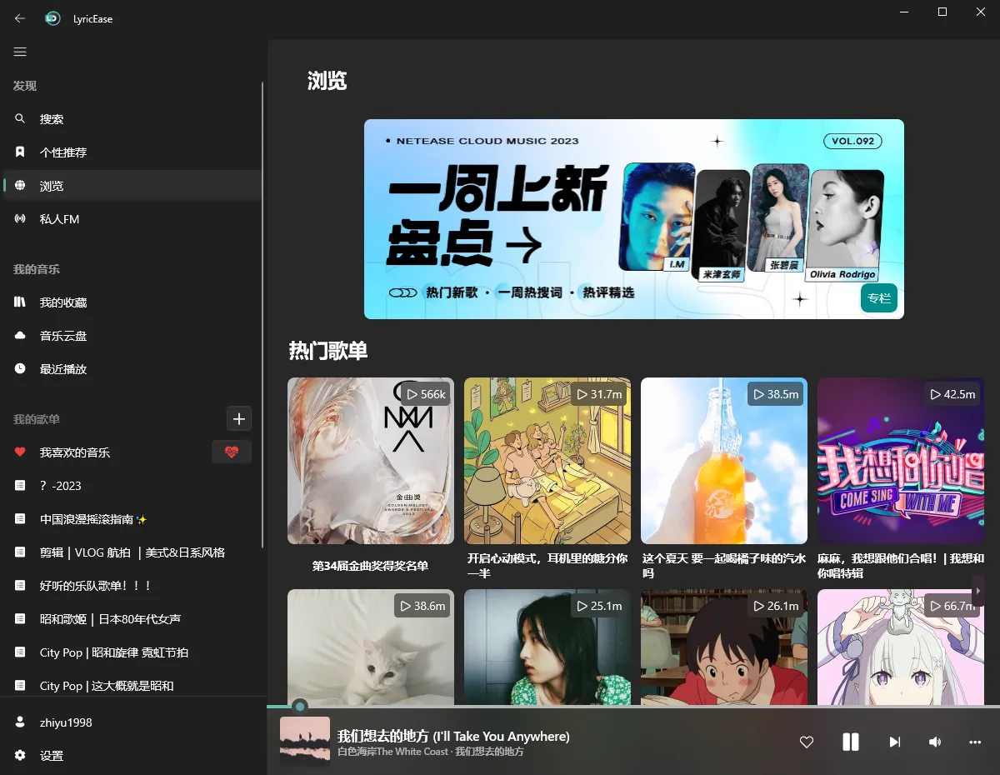

## 第二期：一站式互联网音乐盛宴，尽享芳菲（Listen 1、落雪音乐、YesPlayMusic）

不好意思，喜欢看我文档尤其好物推荐的朋友们，我太喜欢听音乐，以至于想用一个软件就能听到各式各样的音乐，但是目前国内环境太差了，各种音乐版权问题等等，不如使用国外的音乐软件：Apple music（大概5元/月），Spotify（年付80左右），这些都行，就是一些小众乐队的音乐还是要网易云。那么废话不多说，开始推荐！

### Listen 1

[GitHub地址](https://github.com/listen1)

[聚合下载地址](https://listen1.github.io/listen1/)

#### 白色主题

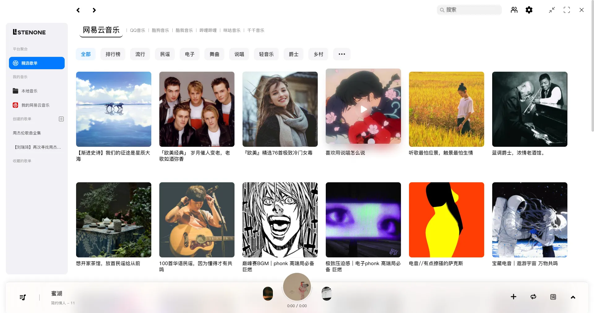

#### 暗色主题

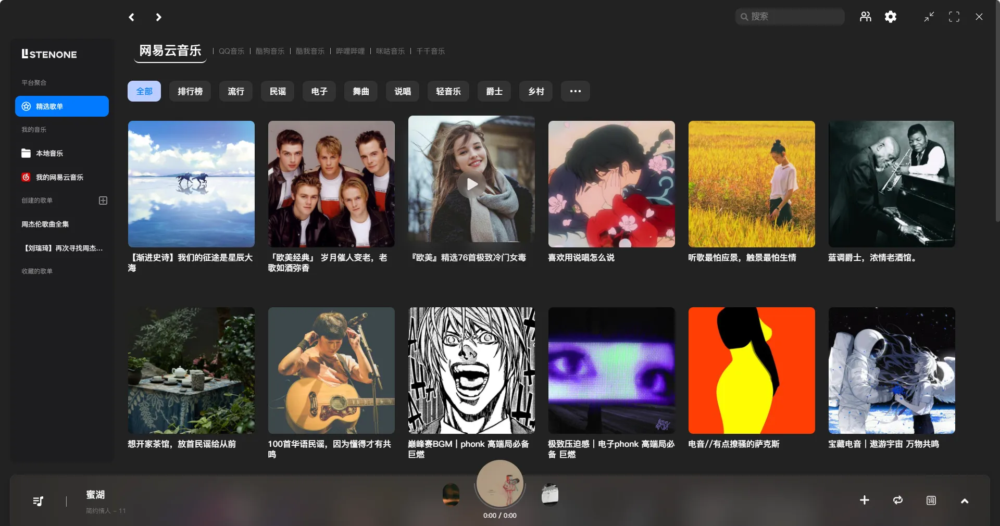

#### 一个你想要的登录方式

#### 播放页

#### 各平台的优势体现

以前QQ音乐过期就在哔哩哔哩听，现在更方便

#### 其他平台的音乐

我的网易云音乐也过来了

#### 自定义

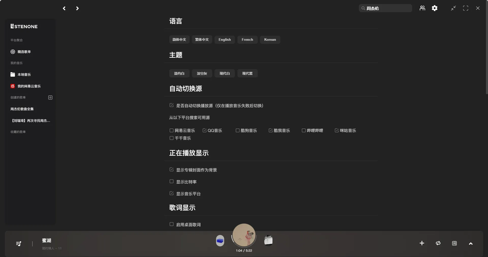

### 落雪音乐

落雪我其实没有深度体验，就是如果listen 1听不到的就到这里听，就截图给大家[体验一下](https://github.lxmusic.folltoshe.com/)

#### 搜索 & 白色主题

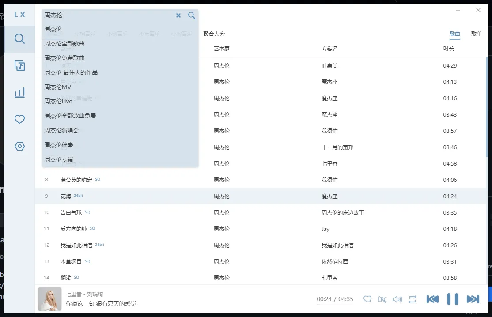

#### 暗色主题

#### 推荐

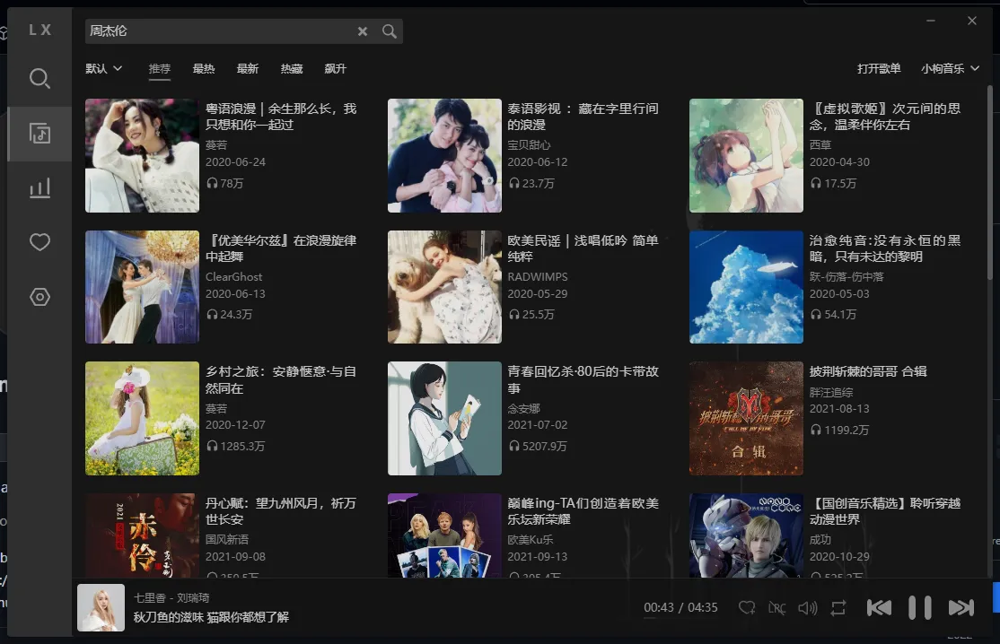

#### 排行榜

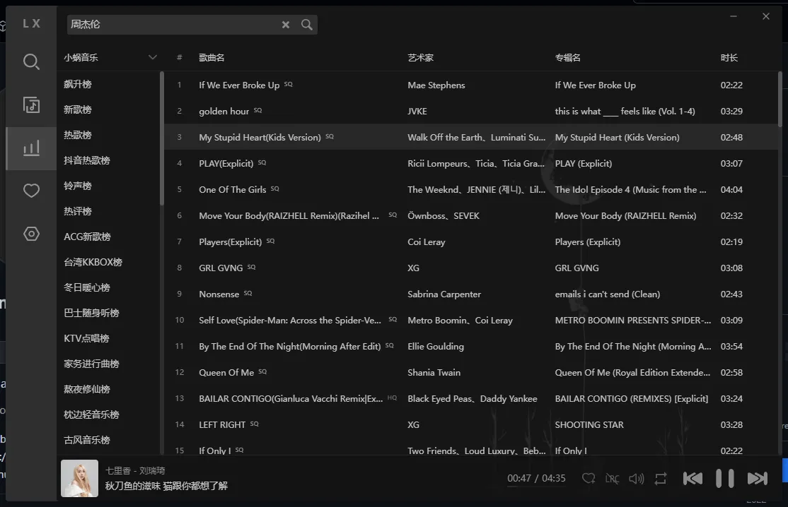

#### 收藏

#### 更多体验

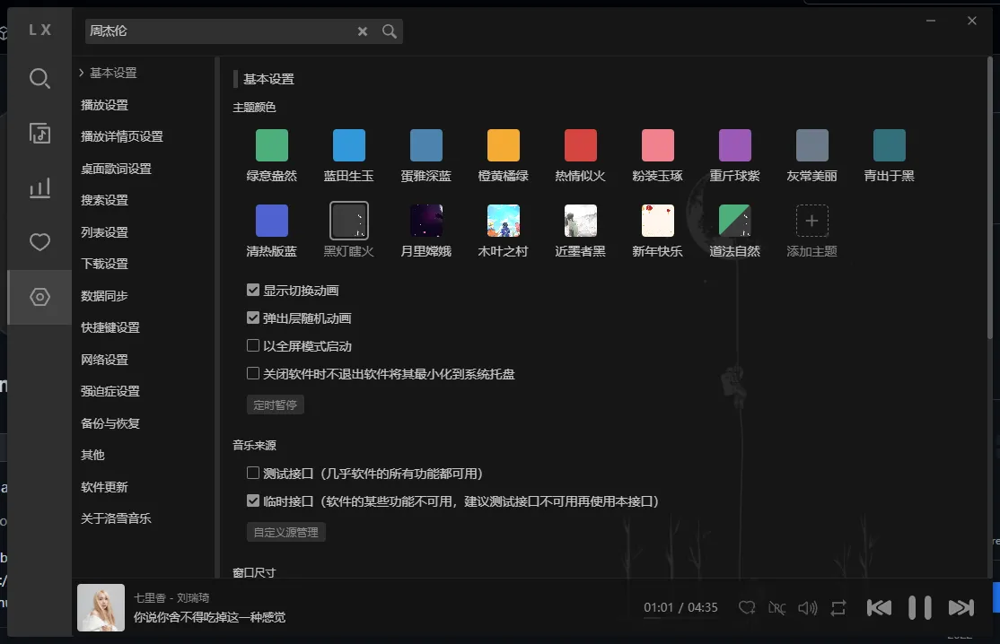

### YesPlayMusic

这个音乐软件可以说是非常美观的，感觉作者和PR的朋友们很懂用户的感觉，非常推荐，我也是有事没事就会使用这个软件！也欢迎各位Vue大佬去GitHub贡献自己的力量！

[去下载](https://github.com/qier222/YesPlayMusic)

#### 首页

#### 发现

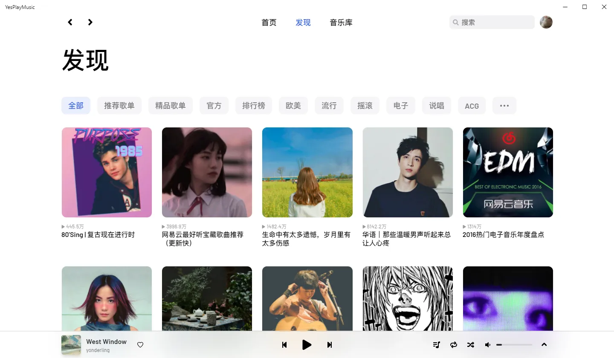

#### 音乐库

#### 歌曲详情

#### 设置，更多体验

#### 周杰伦也是可以听的

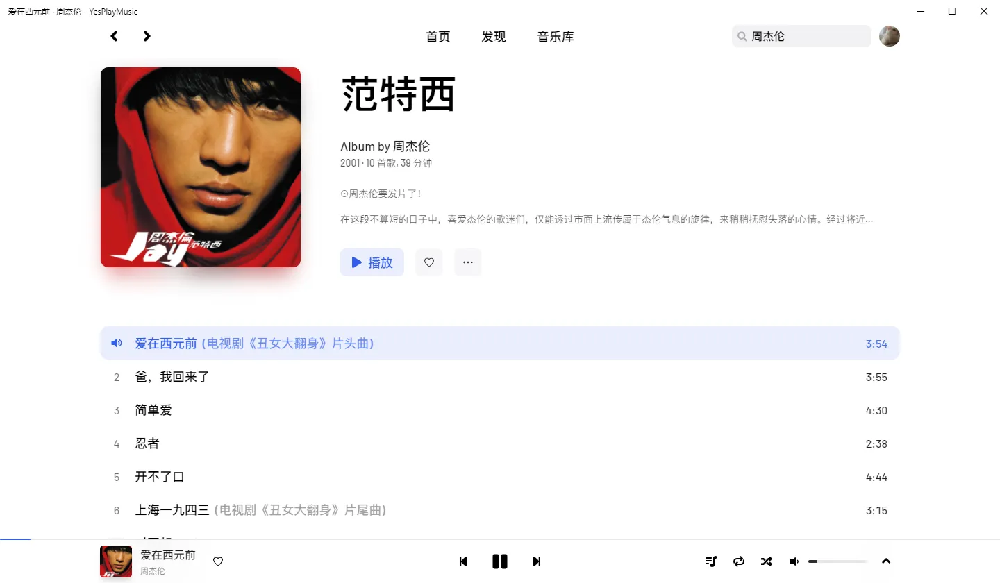
